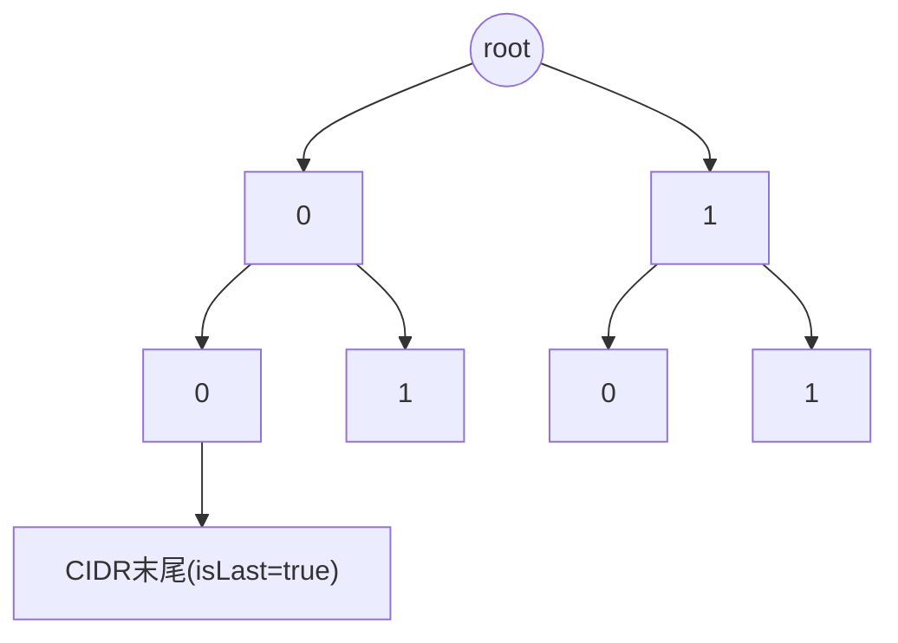
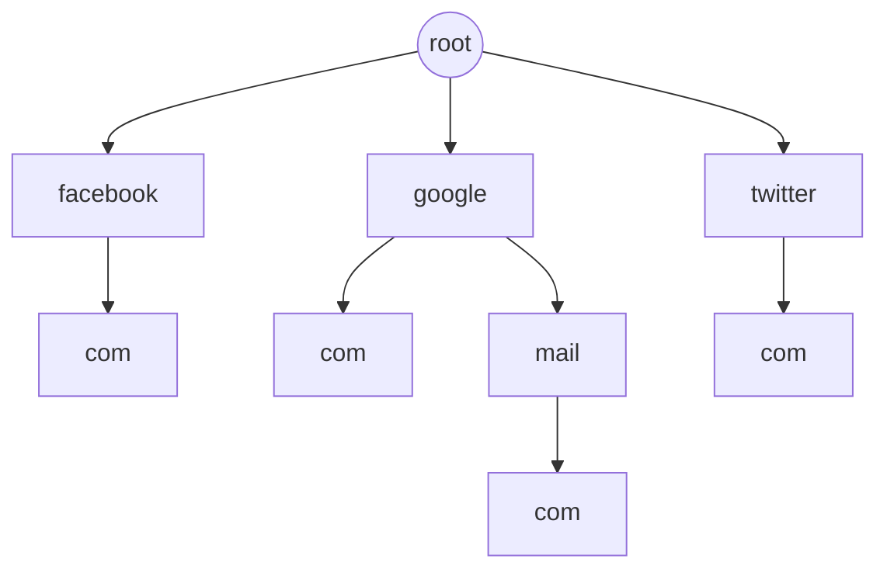
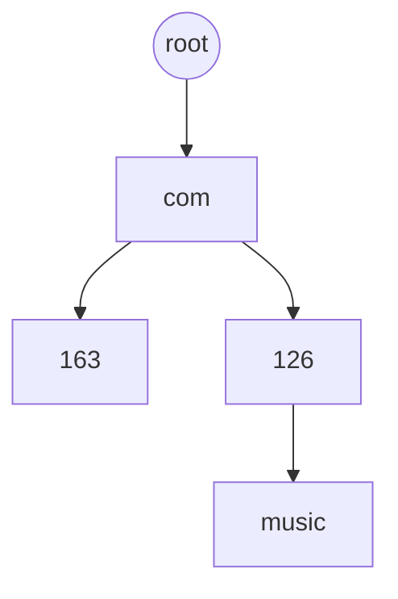
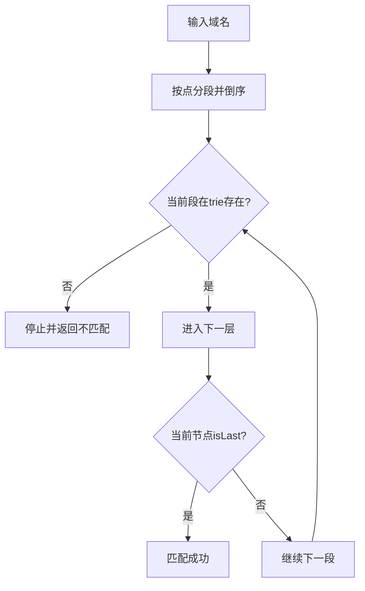
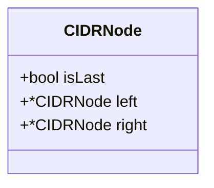
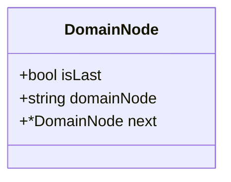

所有完整实现代码:[match](https://github.com/Asutorufa/yuhaiin/tree/master/net/match)

## CIDR

我们知道cidr对ip匹配时,只要cidr的mask长度的前几位与要匹配的ip相同,则可以说匹配成功.

```shell
假设有一个cidr为128.0.0.1/24
转换为二进制 1000 0000.0000 0000.0000 0000.0000 0001/24
可以知道要匹配ip的前24为与cidr的前24(1000 0000.0000 0000.0000 0000)位相同则匹配成功
假设有一个ip 128.0.0.128 二进制为 1000 0000.0000 0000.0000 0000.1000 0000
可以看到前24位与cidr相同 则匹配成功
```

## 域名

域名就比较简单了,直接按点分割就行了

## 前缀树

通过上述规则 我们可以使用前缀树实现CIDR对ip的匹配



当ip匹配到某处时，此处已无任何子树，且是某一cidr的末尾则匹配成功。  
若此处节点为null(golang为nil)且不是某一cidr的末尾则匹配失败。

域名的前缀树相同,只不过域名不再是只有0和1,而且在匹配的时候还需要跳过前面的那些前缀.



在对域名匹配时，如对 `www.play.google.com` 匹配：

- 没有 `www`，跳过
- 没有 `play`，跳过
- 有 `google`，继续
- 有 `com` 且域名已为最后一个节点，判断trie中是否为最后的一个子树；是则匹配成功

这里有一个明显的问题：  
比如我们同时插入了 `music.126.com` 和 `163.com`，然后查询 `music.163.com` 是否被匹配，无法被匹配。因为包含 `music`，会匹配到 `music.126.com` 这条线，而不是 `163.com`。

这里有个很简单的解决方法，就是把域名倒过来插入、倒过来匹配，就跟 JAVA 包名那样。



这样就能被正确匹配了，而且会缩短时间，不会去完整匹配整个域名，只匹配后面有的就行了。



trie树类似上述结构

trie树节点可以这样表示：<!--more-->



域名匹配的节点可以这样表示：



## 使用golang实现

```go
type node struct {
	isLast bool
	left   *node
	right  *node
}

type TrieTree struct {
	root *node
}

func NewTrieTree() *TrieTree {
	return &TrieTree{
		root: &node{},
	}
}
```

对每一个CIDR的插入\
注意: 此处传入的CIDR为CIDR前mask位的二进制形式

```go
func (trie *TrieTree) Insert(str string) {
	nodeTemp := trie.root
	for i := 0; i < len(str); i++ {
		// 1 byte is 49
		if str[i] == 49 {
			if nodeTemp.right == nil {
				nodeTemp.right = new(node)
			}
			nodeTemp = nodeTemp.right
		}
		// 0 byte is 48
		if str[i] == 48 {
			if nodeTemp.left == nil {
				nodeTemp.left = new(node)
			}
			nodeTemp = nodeTemp.left
		}
		if i == len(str)-1 {
			nodeTemp.isLast = true
		}
	}
}
```

对ip的匹配\
注意: 此处传入的ip为ip的二进制形式

```go
func (trie *TrieTree) Search(str string) bool {
	nodeTemp := trie.root
	for i := 0; i < len(str); i++ {
		if str[i] == 49 {
			nodeTemp = nodeTemp.right
		}
		if str[i] == 48 {
			nodeTemp = nodeTemp.left
		}
		if nodeTemp == nil {
			return false
		}
		if nodeTemp.isLast == true {
			return true
		}
	}
	return false
}
```
