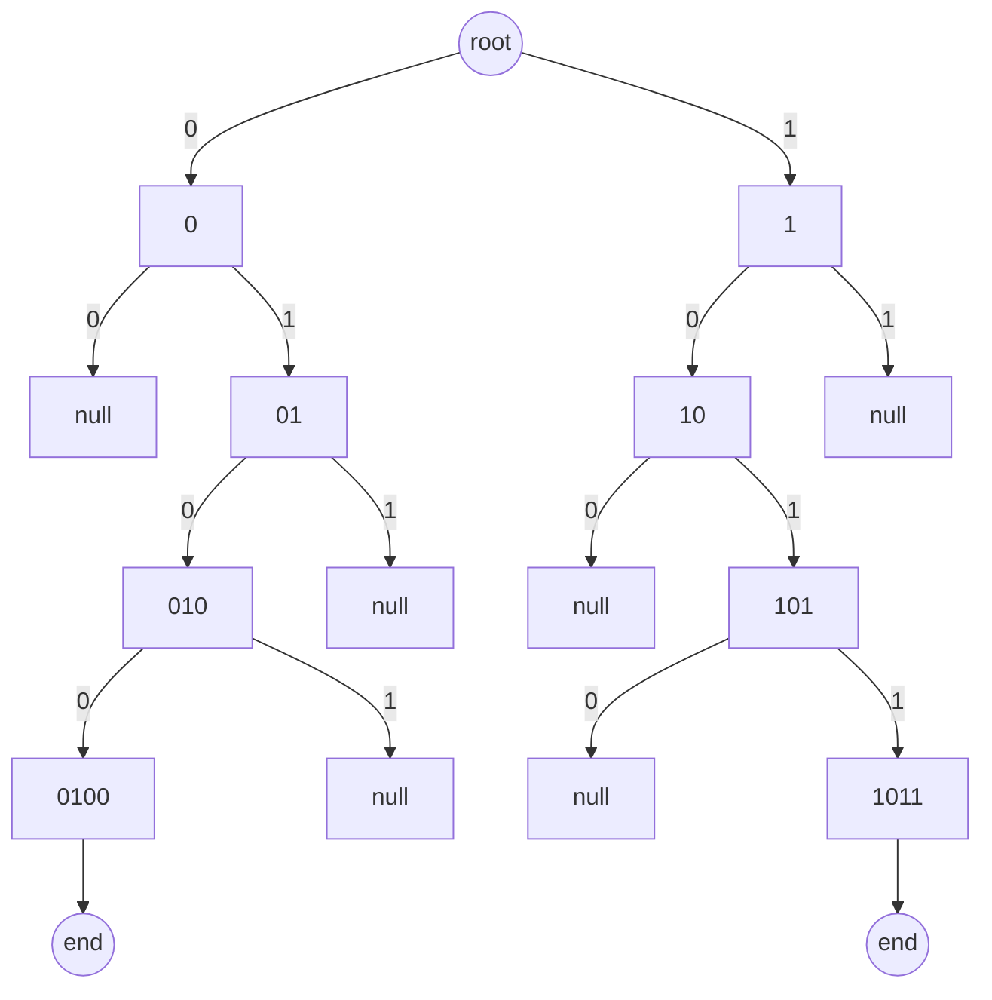

complete document [MaxMind DB File Format SpecificationDescription](https://maxmind.github.io/MaxMind-DB/)

here is only how convert trie tree to array

0100, 1011 -> trie



trie -> array
left is 0, right is 1
value is index of array<!--more-->

| left | right | byte/index |
| --- | --- | --- |
| 2 | 4 | 0-1 |
| null | 6 | 2-3 |
| 8 | null | 4-5 |
| 10 | null | 6-7 |
| null | 12 | 8-9 |
| 14 | null | 10-11 |
| null | 16 | 11-12 |
| end | null | 12-13 |
| null | end | 13-14 |

```text
array: [2,4,null,6,8,null,10,null,null,12,14,null,null,16,end,null,null,end]
```

for example:

index 1:
 next left index 2 is null, so 00* is not exist
 next right index 2+1 = 3 is not null, continue search until end or null

this is one byte as one child, but one byte max is 255, if node more than 255, we can use multiple byte as one child
