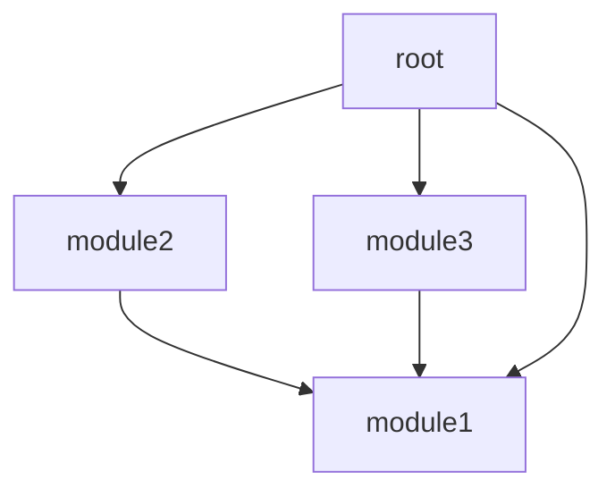

**WIP**
---

terraform はIaC(Infrastructure as Code)のツールです、他のはpulumiなどかあります。

## Infrastructure as Code とは？

サーバやKubernetesなどの管理は全部コード化します、幾つのメリットがあります。

- 管理を簡単になる
- バージョンの管理可能、人のミスを防ぐ。　
- 再利用可能、効率的利用をできる。
- terraformでサービス間の依存関係を自動的に計算できます。
- 構築は自動化する。

## 使ったみた

```md
- +
  + project1 -+
  |           +- main.tf
  |           +- variables.tf
  |           +- pro.tfvars
  |           +- debug.tfvars
  |
  +- modules -+
              +- module1 -+
              |            +- main.tf
              |            +- variables.tf
              |            +- outputs.tf
              |
              +- module2 -+
                           +- main.tf
                           +- variables.tf
                           +- outputs.tf
```

プロジェクトは基本的には以上の形みたい。　　
modulesは関数と似たようなものですが、グローバ変数作るはできない、状態もないです。実は関数よりtemplateと思います。　　
例えproject1の`main.tf`で二つの`modules1`定義したらダブルの資源が消耗します。

```t
module "module1-1" {
  source = "../modules/module1"
}

module "module1-2" {
  source = "../modules/module1"
}
```

<!--more-->

root-variable.tf

```t
variable "storageClass" {
  type    = string
  default = "my-sc"
}

variable "minioReplicas" {
  type    = number
  default = 3
}
```

variableは変数です。モデル使用する時書き換え可能です。定義しないとdefaultを使えます。

```t
module "module1" {
  source = "../modules/module1"
  storageClass = "my-sc-2"
}
```

redis.tf

```t
resource "kubernetes_stateful_set" "redis" {
  metadata {
    name      = "redis"
    namespace = var.namespace

    labels = {
      app = "redis"
    }
  }

  spec {
    replicas = 1

    selector {
      match_labels = {
        app = "redis"
      }
    }

    template {
      metadata {
        name = "redis"

        labels = {
          app = "redis"
        }
      }

      spec {
        container {
          name  = "redis"
          image = var.image

          port {
            name           = "redis"
            container_port = 6379
          }
        }
      }
    }

    service_name = "redis"
  }
}

resource "kubernetes_service" "redis" {
  metadata {
    name      = "redis"
    namespace = var.namespace
  }

  spec {
    port {
      name        = "redis"
      port        = 6379
      target_port = kubernetes_stateful_set.redis.spec.0.template.0.spec.0.container.0.port.0.container_port
    }

    selector = {
      app = "redis"
    }

    type = "ClusterIP"
  }
}
```

outputs.tf

```t
output "redis_port" {
  value = kubernetes_stateful_set.redis.spec.0.template.0.spec.0.container.0.port.0.container_port
}

output "tempoBucket" {
  value = var.tempoBucket
}

output "host" {
  value = "minio.metrics.svc.cluster.local:9000"
}
```


outputは関数の戻り値と似ている。変数、リソースなどを使える。

main.tf

```t
provider "kubernetes" {
  config_path = "${path.module}/../config.yaml"
}


module "redis" {
  source = "../modules/redis"
}
```

apply

```shell
terraform init
terraform apply --var-file=debug.tfvars 
```

`main.tf`で全部のモデルやリソースを定義し、`terraform apply`は実際の変更を開始します。

## 再利用ダメ

module1.tf

```t
resource "kubernetes_service" "module1" {
  ...
}
```

modules2.tf

```t
module "module1" {
  source = "../module1"
}
```

modules3.tf

```t
module "module1" {
  source = "../module1"
}
```

root-main.tf

```t
module "module1" {
  source = "../modules/module1"
}

module "module2" {
  source = "../modules/module2"
}

module "module3" {
  source = "../modules/module3"
}
```


