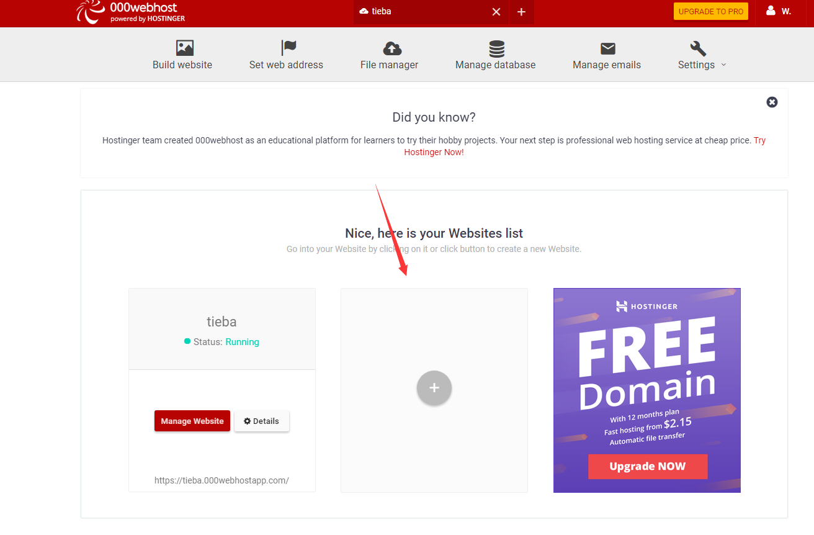
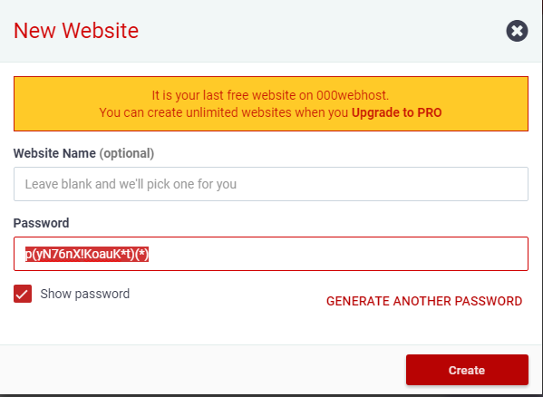
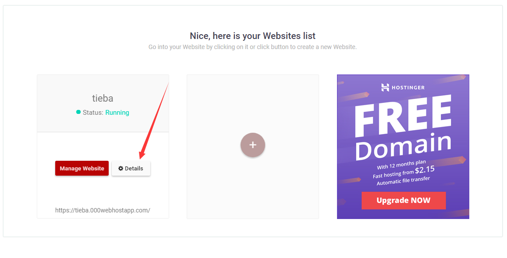
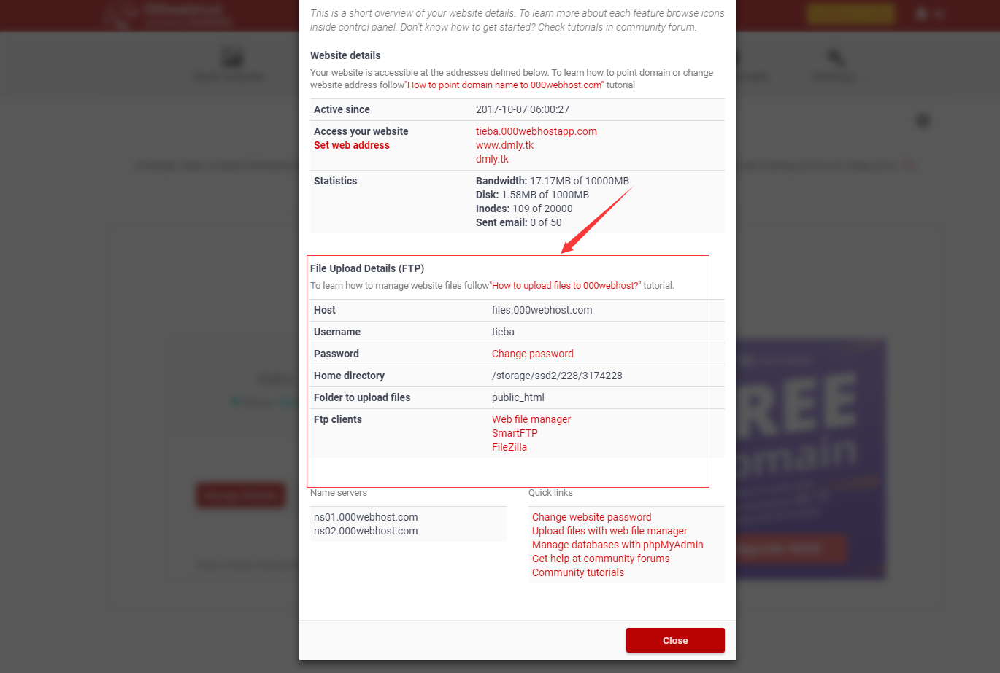
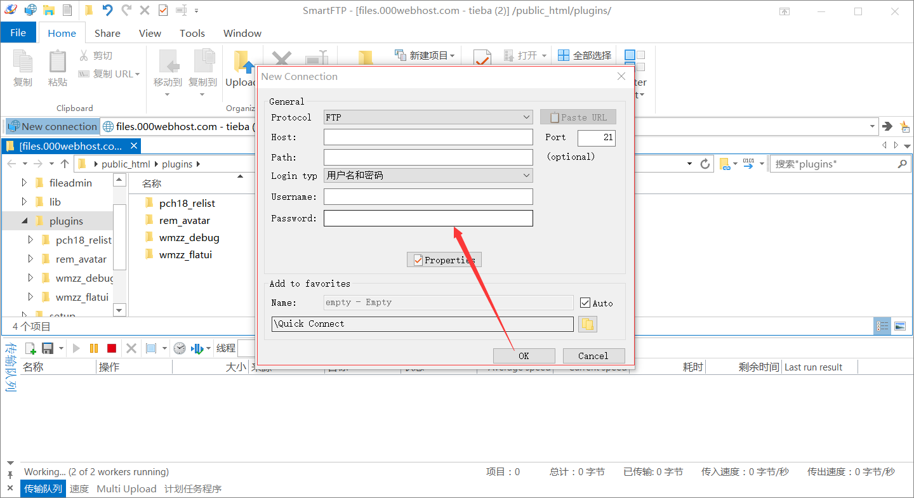
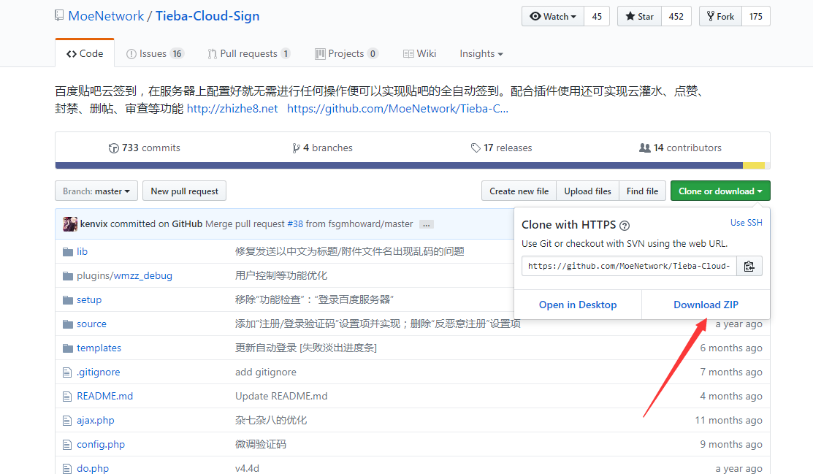
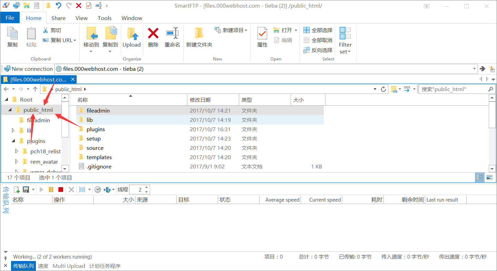
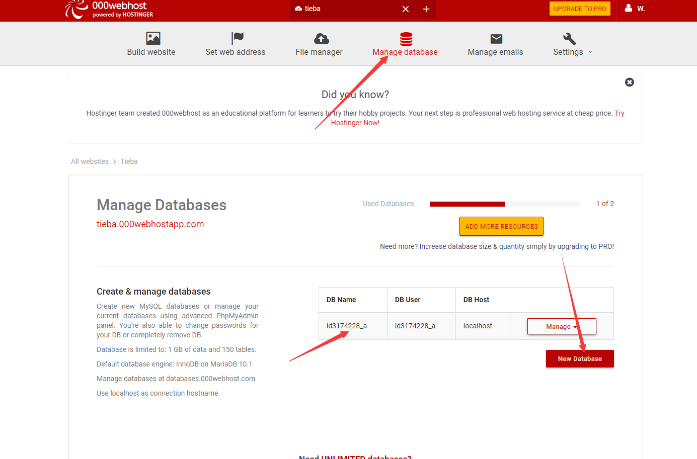
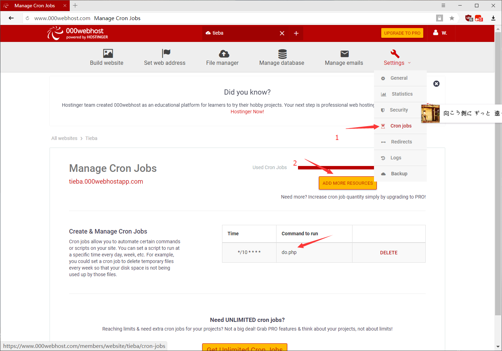

## --
这是我自建的贴吧云签到:~~http://dmly.tk~~(已失效)
之后为教程

### 注册免费空间
首先你得注册一个三蛋空间的账号,三蛋空间注册网址:[三蛋空间](https://www.000webhost.com/members/website/list)<!--more-->

### 创建网站
注册完成之后点击这里 添加一个空模版,如图

写上名字和密码,点击create

### ftp 
下载SmartFTP Client或者其他你熟悉的ftp上传工具,这里百度就行了
进入三蛋空间的管理网站,点击这里,如图

把这里的信息填入SmartFTP Client中

然后点ok

### 上传
贴吧云签到源码github地址:[Tieba-Cloud-Sign](https://github.com/MoeNetwork/Tieba-Cloud-Sign)
点击这里下载zip并解压

将解压得到的所有文件拖入ftp上的public_html文件夹中

### 创建数据库
然后进入三蛋空间创建数据库
三蛋空间会自动给你的数据库名字前加上数字,所以之后在贴吧安装中要注意

### 安装
之后进入你的网站,然后安装就行了.

### 创建cron job
安装完成后就要把do.php加入cron,否则是不会自动签到的,按图中的步骤进行

