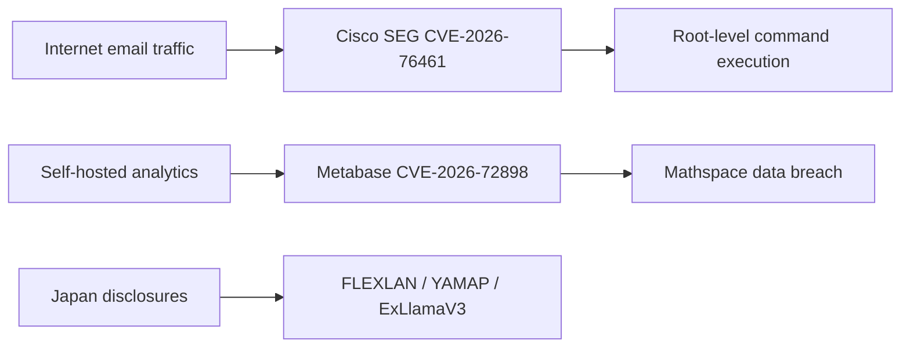

## Executive summary

The highest-priority new issue on September 14 is Cisco Secure Email Gateway CVE-2026-76461. The flaw sits in AsyncOS email parsing and can be triggered remotely without authentication by sending a crafted message through an affected appliance, leading to SQL injection and ultimately arbitrary command execution as root. Cisco PSIRT confirmed active exploitation, and CISA added the vulnerability to KEV on the same day.

Two real-world data incidents also deserve attention. Mathspace disclosed a breach affecting more than one million people after attackers exploited Metabase CVE-2026-72898 against a self-hosted analytics environment. IDScan.net's identity-data incident remains under investigation; the company has confirmed that names and government-issued identification numbers may have been accessed, while very large dark-web record-count claims remain unverified by the vendor.

Japan-focused disclosures included an update for multiple CONTEC FLEXLAN vulnerabilities, a YAMAP Android in-app-browser access-control issue, and an ExLlamaV3 CUDA-extension out-of-bounds DoS vulnerability.

## Risk paths for the day

> Figure: primary risk paths for September 14, based only on verified events in this report.

## Priority threats

### Cisco Secure Email Gateway CVE-2026-76461: actively exploited unauthenticated root RCE

> This is the day's most urgent new item: the attack surface is the email gateway itself, no authentication is required, and successful exploitation can lead directly to root-level command execution.

**Severity:** Critical  
**Status:** Confirmed exploitation / CISA KEV  
**CVSS:** 9.8  
**CVE:** CVE-2026-76461  
**Affected:** Cisco Secure Email Gateway / AsyncOS

Cisco says the issue is caused by insufficient validation in email-parsing logic. An attacker can send a crafted email containing malicious SQL through an affected device; exploitation can execute arbitrary SQL statements and trigger command execution with root privileges on the underlying operating system. Cisco PSIRT explicitly confirmed active exploitation in September 2026, and the Canadian Cyber Centre reported that CISA added the CVE to KEV on September 14.

#### Impact

Email security gateways sit at a high-trust boundary and may expose inbound mail flows, quarantine stores, policies and administrative credentials. Compromise can therefore extend beyond the appliance into mail monitoring, credential theft, lateral movement and persistence.

#### Recommendations

- Upgrade immediately to Cisco fixed releases such as 15.5.5-014, 16.0.4-302, 16.5.0-780 or later secure versions.
- Cisco states there is no workaround that substitutes for patching.
- Hunt for unusual processes, root-level command execution, persistence changes, administrative-account changes and suspicious outbound connections from the gateway.
- If compromise indicators are present, treat the appliance as a high-privilege edge-system breach and rotate administrative credentials.

#### Sources

- [Cisco — Secure Email Gateway SQL Injection Vulnerability](https://www.cisco.com/c/en/us/support/docs/csa/cisco-sa-esa-inj-2bLVGmhX.html)
- [Canadian Centre for Cyber Security — AV26-921](https://www.cyber.gc.ca/en/alerts-advisories/cisco-security-advisory-av26-921)
- [CISA Known Exploited Vulnerabilities Catalog](https://www.cisa.gov/known-exploited-vulnerabilities-catalog)

### Cisco Secure Email hardening release: additional high-impact flaws on the same platform

**Severity:** High  
**Status:** No separate confirmed exploitation beyond CVE-2026-76461  
**CVE:** CVE-2026-20353, CVE-2026-76440, CVE-2026-76441, CVE-2026-76442, CVE-2026-76443  
**Affected:** Cisco Secure Email Gateway / Secure Email and Web Manager

Cisco released a companion hardening update covering path traversal, improper access control, resource-lifecycle issues, input validation and injection classes, with several categories reaching CVSS 9.8. Cisco says the issues were found during internal testing that combined existing test processes with frontier AI models.

#### Recommendation

Organizations already scheduling emergency maintenance for CVE-2026-76461 should upgrade to the full hardening release rather than fixing only the exploited CVE, avoiding a second maintenance window while leaving same-platform critical weaknesses behind.

#### Sources

- [Cisco — Secure Email Gateway and Secure Email and Web Manager Security Hardening Release](https://www.cisco.com/c/en/us/support/docs/csa/cisco-sa-hardening-esa-dfCrfXkm.html)

## Confirmed real-world exploitation

### Mathspace: attackers used Metabase CVE-2026-72898 to reach an internal reporting database

**Severity:** High  
**Status:** Confirmed vulnerability exploitation leading to data exposure  
**CVE:** CVE-2026-72898  
**Affected:** Self-hosted Metabase / Mathspace analytics environment

Check Point Research's September 14 report says Australian and New Zealand education platform Mathspace suffered a breach affecting more than one million people. Attackers exploited the Metabase SQL-injection flaw CVE-2026-72898 against a self-hosted deployment and accessed an internal reporting database. Exposed data reportedly included names, email addresses, usernames and location information.

KrCERT had already warned that the relevant Metabase flaws were associated with real attack activity and recommended upgrading affected deployments.

#### Recommendations

- Upgrade self-hosted Metabase to fixed branches such as x.63.5, x.62.9, x.61.11, x.60.17 or newer secure releases.
- Review database-access logs, application query history and anomalous bulk reads.
- Reassess database privileges granted to BI and reporting systems so an analytics-platform compromise does not automatically become broad data access.

#### Sources

- [Check Point Research — 14th September Threat Intelligence Report](https://research.checkpoint.com/2026/14th-september-threat-intelligence-report/)
- [KrCERT — Metabase security update advisory](https://www.krcert.or.kr/kr/bbs/view.do?bbsId=B0000133&menuNo=205020&nttId=72178)

## Data breach and identity risk

### IDScan.net: identity-verification cloud incident remains under investigation

**Severity:** High  
**Status:** Unauthorized-access risk confirmed; final scope still under investigation  
**Affected:** IDScan.net customer cloud accounts

IDScan.net says it received information on September 1 indicating that data in customer cloud accounts may have been accessed or copied without authorization. The company confirmed potentially affected data categories including names, driver's-license numbers and other government-issued identification numbers. The FBI is also investigating public reporting involving a large collection of U.S. and Canadian identity documents.

A crucial evidence distinction remains: the dark-web service claimed more than 150 million driver's-license records, but that number is not the same as a vendor-confirmed affected-person count.

#### Recommendations

- Affected organizations should follow vendor notifications and determine what identity data their own workflows stored or uploaded.
- Strengthen secondary checks for account recovery, enrollment and other high-risk identity workflows where government-ID data could be abused.
- Users should expect highly credible phishing and identity-fraud attempts built from genuine identity attributes.

#### Sources

- [IDScan.net — Notification of Data Security Incident](https://idscan.net/press-release/notification-of-data-security-incident/)
- [Reuters — FBI probes report of exposed driver licenses](https://www.reuters.com/world/us/fbi-says-it-is-investigating-report-that-millions-us-drivers-licenses-exposed-2026-09-02/)

## Japan / regional security updates

### CONTEC FLEXLAN: multiple command-execution, traversal and memory-safety issues

**Severity:** High  
**Status:** No reliable evidence of exploitation in the wild  
**CVE:** CVE-2026-82762 through CVE-2026-82772  
**Affected:** Multiple CONTEC FLEXLAN wireless-LAN series

JVN updated the FLEXLAN advisory on September 14. The set includes OS command injection, XSS, CSRF, path traversal and buffer-overflow issues. Several vulnerabilities reach CVSS 3.1 scores of 8.8, and some affected models can allow arbitrary OS-command or program execution under the documented preconditions.

#### Recommendation

Organizations using affected FX5000, FX4000, FX3000, SGA1000, RP-WAH-SR and EC1000 families should compare model and firmware versions against JVN's affected list, upgrade firmware, and restrict access to management interfaces.

#### Sources

- [JVN — Multiple vulnerabilities in CONTEC FLEXLAN series](https://jvn.jp/vu/JVNVU99009004/index.html)

### YAMAP Android: insufficient source verification in the in-app browser

**Severity:** Medium  
**Status:** No confirmed exploitation  
**CVSS:** 5.4 (v3) / 5.1 (v4)  
**CVE:** CVE-2026-85125  
**Affected:** YAMAP Android v17.1.0 and earlier

The flaw affects verification of the communication source used by the in-app browser. Successful exploitation can leak application information or redirect users to unintended websites and requires user interaction.

**Recommendation:** Update YAMAP for Android to the latest version.

#### Sources

- [JVN iPedia — CVE-2026-85125](https://jvndb.jvn.jp/en/contents/2026/JVNDB-2026-000131.html)

### ExLlamaV3 CVE-2026-84286: out-of-bounds access in CUDA extension can trigger DoS

**Severity:** Medium  
**Status:** No confirmed exploitation  
**CVE:** CVE-2026-84286  
**Affected:** ExLlamaV3 `exllamav3_ext`

CERT/CC reports insufficient input validation in the `exllamav3_ext` CUDA extension. Crafted values can produce a negative array index and illegal GPU memory access, causing process crashes or unstable execution. The issue is particularly relevant to AI inference infrastructure because downstream projects that bundle the affected extension inherit the risk.

#### Recommendations

- Update to an ExLlamaV3 revision containing the upstream fix or apply the merged patch.
- Rebuild downstream packages to ensure stale copies of the extension are not retained.
- For services handling untrusted models or external inputs, isolate workers and bound automatic restarts so a crash condition does not escalate into service-wide failure.

#### Sources

- [CERT/CC VU#369611](https://kb.cert.org/vuls/id/369611)
- [JVN — JVNVU#94022278](https://jvn.jp/vu/JVNVU94022278/index.html)

## Daily observations

- **Security appliances remain high-value attack surfaces.** Cisco SEG sits directly on the mail boundary, and this flaw combines unauthenticated remote reachability with root-level command execution.
- **Analytics platforms are becoming data-exfiltration pivots.** The Mathspace case shows how a self-hosted BI system with broad database visibility can magnify the impact of a single application vulnerability.
- **Regional disclosures still matter even when they do not trend globally.** FLEXLAN, YAMAP and ExLlamaV3 are not global headlines, but each gives affected operators a clear action to take.
- **Breach-scale claims require evidence grading.** The IDScan dark-web count should remain labeled as a claim until the vendor or investigators establish the actual affected population.

---
Generated by ChatGPT | GPT-5.6 Sol
