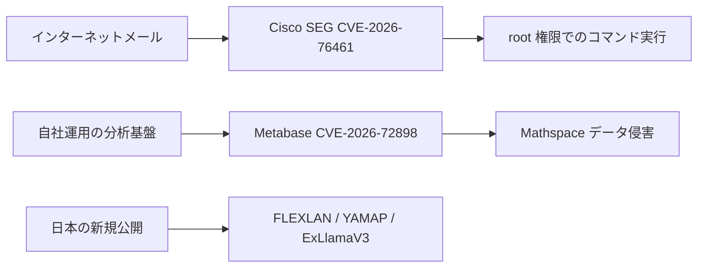

## 本日の概要

9月14日に最優先で対応すべき新規事象は Cisco Secure Email Gateway の CVE-2026-76461 です。脆弱性は AsyncOS のメール解析処理に存在し、攻撃者は認証なしで細工したメールを対象機器に通過させることで SQL インジェクションを発生させ、最終的に基盤 OS 上で root 権限の任意コマンド実行に至る可能性があります。Cisco PSIRT は実際の悪用を確認しており、CISA も同日に KEV へ追加しました。

現実の被害事例としては、Mathspace が 100 万人超に影響するデータ侵害を公表しており、攻撃では自社運用の Metabase に対する CVE-2026-72898 が使われたと報告されています。また IDScan.net の本人確認データに関するインシデントは引き続き調査中で、氏名や政府発行 ID 番号が不正にアクセスされた可能性は確認されていますが、ダークウェブ側が主張する非常に大きな件数はベンダーが確定した影響人数とは区別する必要があります。

日本では JVN が CONTEC FLEXLAN シリーズの複数脆弱性を更新したほか、YAMAP Android アプリのアクセス制御問題と、ExLlamaV3 CUDA 拡張における境界外アクセスによる DoS リスクを公開しました。

## 本日のリスク経路

> 図：9月14日の主要なリスク経路。本稿で検証できた事象のみを基に整理しています。

## 重点脅威

### Cisco Secure Email Gateway CVE-2026-76461：実際に悪用されている未認証 root RCE

> 当日の最重要事象です。攻撃対象がメールゲートウェイそのもので、認証不要かつ成功時に root 権限でのコマンド実行へ直結します。

**Severity:** Critical  
**Status:** 悪用確認済み / CISA KEV  
**CVSS:** 9.8  
**CVE:** CVE-2026-76461  
**Affected:** Cisco Secure Email Gateway / AsyncOS

Cisco によると、原因はメール解析ロジックの入力検証不足です。攻撃者は悪意のある SQL を含むメールを対象機器経由で送信することで、任意の SQL 実行に加えて基盤 OS 上で root 権限のコマンド実行を引き起こす可能性があります。Cisco PSIRT は 2026 年 9 月の active exploitation を明示的に確認しており、カナダ Cyber Centre も CISA が 9 月 14 日に KEV へ追加したと報告しています。

#### 影響

メールセキュリティゲートウェイは高信頼の境界に置かれ、受信メール、隔離領域、ポリシー、管理資格情報などへアクセスできます。侵害されると、メール監視、認証情報窃取、横展開、長期的な永続化へ発展する可能性があります。

#### 推奨対応

- Cisco が示す修正版 15.5.5-014、16.0.4-302、16.5.0-780、またはそれ以降の安全なリリースへ直ちに更新する。
- Cisco は有効な workaround がないと明記しているため、設定変更だけで代替しない。
- 異常プロセス、root 権限コマンド、永続化変更、管理アカウント変更、不審な外向き通信を確認する。
- 侵害兆候がある場合は、高権限の境界機器が侵害されたものとして管理資格情報をローテーションする。

#### Sources

- [Cisco — Secure Email Gateway SQL Injection Vulnerability](https://www.cisco.com/c/en/us/support/docs/csa/cisco-sa-esa-inj-2bLVGmhX.html)
- [Canadian Centre for Cyber Security — AV26-921](https://www.cyber.gc.ca/en/alerts-advisories/cisco-security-advisory-av26-921)
- [CISA Known Exploited Vulnerabilities Catalog](https://www.cisa.gov/known-exploited-vulnerabilities-catalog)

### Cisco Secure Email hardening release：同一基盤で複数の高影響脆弱性を同時修正

**Severity:** High  
**Status:** CVE-2026-76461 以外について独立した悪用確認なし  
**CVE:** CVE-2026-20353、CVE-2026-76440、CVE-2026-76441、CVE-2026-76442、CVE-2026-76443  
**Affected:** Cisco Secure Email Gateway / Secure Email and Web Manager

Cisco は同日に hardening release も公開し、パストラバーサル、不適切なアクセス制御、リソースライフサイクル管理、入力検証、インジェクション系の問題を修正しました。複数の脆弱性クラスは最大 CVSS 9.8 です。Cisco は、既存のテスト手法と frontier AI models を組み合わせた内部テストでこれらを発見したと説明しています。

#### 推奨対応

CVE-2026-76461 対応で緊急メンテナンスを予定している環境は、単一 CVE だけを直すのではなく hardening release 全体へ更新し、同一基盤上の高危険度問題をまとめて解消する方が合理的です。

#### Sources

- [Cisco — Secure Email Gateway and Secure Email and Web Manager Security Hardening Release](https://www.cisco.com/c/en/us/support/docs/csa/cisco-sa-hardening-esa-dfCrfXkm.html)

## 悪用確認済み

### Mathspace：Metabase CVE-2026-72898 を悪用し内部レポート DB にアクセス

**Severity:** High  
**Status:** 脆弱性悪用によるデータ侵害を確認  
**CVE:** CVE-2026-72898  
**Affected:** 自社運用 Metabase / Mathspace 分析環境

Check Point Research の 9 月 14 日レポートによると、オーストラリアとニュージーランドで利用される教育プラットフォーム Mathspace が 100 万人超に影響するデータ侵害を受けました。攻撃者は自社運用 Metabase の SQL インジェクション脆弱性 CVE-2026-72898 を悪用し、内部 reporting database にアクセスしたとされています。漏えい情報には氏名、メールアドレス、ユーザー名、位置情報などが含まれます。

KrCERT も以前、この Metabase 脆弱性群について実際の攻撃・被害が発生しているとして更新を推奨していました。

#### 推奨対応

- 自社運用 Metabase を x.63.5、x.62.9、x.61.11、x.60.17、またはそれ以降の修正版へ更新する。
- DB アクセスログ、アプリケーションのクエリ履歴、大量読み出しなどの異常を確認する。
- BI/レポート基盤に付与している DB 権限を見直し、分析基盤の侵害が広範なデータアクセスへ直結しないようにする。

#### Sources

- [Check Point Research — 14th September Threat Intelligence Report](https://research.checkpoint.com/2026/14th-september-threat-intelligence-report/)
- [KrCERT — Metabase security update advisory](https://www.krcert.or.kr/kr/bbs/view.do?bbsId=B0000133&menuNo=205020&nttId=72178)

## データ侵害 / 本人確認リスク

### IDScan.net：本人確認クラウドのインシデントは引き続き調査中

**Severity:** High  
**Status:** 不正アクセスの可能性を確認、最終影響範囲は調査中  
**Affected:** IDScan.net customer cloud accounts

IDScan.net は、9 月 1 日に顧客クラウドアカウント内のデータが不正にアクセスまたはコピーされた可能性を示す情報を受けたと説明しています。影響した可能性のあるデータとして、氏名、運転免許証番号、その他の政府発行 ID 番号を挙げています。FBI も米国・カナダの大量の身分証データに関する公開報道を調査しています。

重要なのは証拠レベルを分けることです。ダークウェブ側は 1.5 億件超の運転免許証データを主張していますが、これはベンダーがフォレンジック調査を終えて確認した被害人数ではありません。

#### 推奨対応

- 関係組織はベンダーからの続報を確認し、自社ワークフローで保存・アップロードした本人確認情報の種類を特定する。
- アカウント復旧、新規登録、高リスク本人確認に追加チェックを導入する。
- 利用者は実在する氏名や証明書情報を使った高精度なフィッシングや身元詐欺を警戒する。

#### Sources

- [IDScan.net — Notification of Data Security Incident](https://idscan.net/press-release/notification-of-data-security-incident/)
- [Reuters — FBI probes report of exposed driver licenses](https://www.reuters.com/world/us/fbi-says-it-is-investigating-report-that-millions-us-drivers-licenses-exposed-2026-09-02/)

## 日本 / 地域別セキュリティ更新

### CONTEC FLEXLAN：コマンド実行、パストラバーサル、バッファオーバーフローなど複数の高危険度問題

**Severity:** High  
**Status:** 信頼できる悪用確認なし  
**CVE:** CVE-2026-82762 から CVE-2026-82772  
**Affected:** 複数の CONTEC FLEXLAN 無線 LAN シリーズ

JVN は 9 月 14 日に FLEXLAN の情報を更新しました。OS command injection、XSS、CSRF、path traversal、buffer overflow を含み、一部は CVSS 3.1 で 8.8 に達します。条件を満たすと任意 OS コマンドやプログラム実行につながるモデルもあります。

#### 推奨対応

FX5000、FX4000、FX3000、SGA1000、RP-WAH-SR、EC1000 などを利用する組織は JVN の対象モデル・ファームウェア一覧と照合し、最新版へ更新したうえで管理インターフェースへのアクセスを制限してください。

#### Sources

- [JVN — CONTEC FLEXLAN シリーズの複数脆弱性](https://jvn.jp/vu/JVNVU99009004/index.html)

### YAMAP Android：アプリ内ブラウザの通信元検証不備

**Severity:** Medium  
**Status:** 悪用確認なし  
**CVSS:** 5.4 (v3) / 5.1 (v4)  
**CVE:** CVE-2026-85125  
**Affected:** YAMAP Android v17.1.0 以前

アプリ内ブラウザで通信元の検証が不十分なため、アプリ内情報の漏えいや意図しない Web サイトへの遷移が発生する可能性があります。悪用にはユーザー操作が必要です。

**推奨対応:** Android 版 YAMAP を最新版へ更新してください。

#### Sources

- [JVN iPedia — CVE-2026-85125](https://jvndb.jvn.jp/ja/contents/2026/JVNDB-2026-000131.html)

### ExLlamaV3 CVE-2026-84286：CUDA 拡張の境界外アクセスにより DoS が可能

**Severity:** Medium  
**Status:** 悪用確認なし  
**CVE:** CVE-2026-84286  
**Affected:** ExLlamaV3 `exllamav3_ext`

CERT/CC は `exllamav3_ext` CUDA 拡張の入力検証不足を報告しています。細工した値により負の配列インデックスと不正な GPU メモリアクセスが発生し、プロセスクラッシュや不安定な状態につながります。影響を受ける拡張を組み込む下流プロジェクトにもリスクが波及するため、AI 推論基盤では特に注意が必要です。

#### 推奨対応

- 上流修正を含む ExLlamaV3 へ更新するか、公式にマージされたパッチを適用する。
- 下流パッケージを再ビルドし、古い拡張が残っていないことを確認する。
- 不審なモデルや外部入力を扱う推論サービスでは worker を分離し、クラッシュの連鎖がサービス全体の停止につながらないよう再起動を制御する。

#### Sources

- [CERT/CC VU#369611](https://kb.cert.org/vuls/id/369611)
- [JVN — JVNVU#94022278](https://jvn.jp/vu/JVNVU94022278/index.html)

## 本日の所見

- **セキュリティ製品自身も高価値の攻撃面です。** Cisco SEG はメール境界に配置され、今回の脆弱性は未認証で到達でき root 権限実行まで可能です。
- **分析基盤が新たなデータ流出ポイントになっています。** Mathspace の事例は、広い DB 参照権限を持つ自社運用 BI が侵害時の影響を増幅することを示しています。
- **地域限定の公開情報も実務上は重要です。** FLEXLAN、YAMAP、ExLlamaV3 は世界的な大見出しではありませんが、該当利用者には明確な対応価値があります。
- **漏えい規模は証拠の強さを分けて扱うべきです。** IDScan の暗市場件数は、ベンダーや調査機関が実際の影響範囲を確定するまでは claim として扱う必要があります。

---
Generated by ChatGPT | GPT-5.6 Sol
