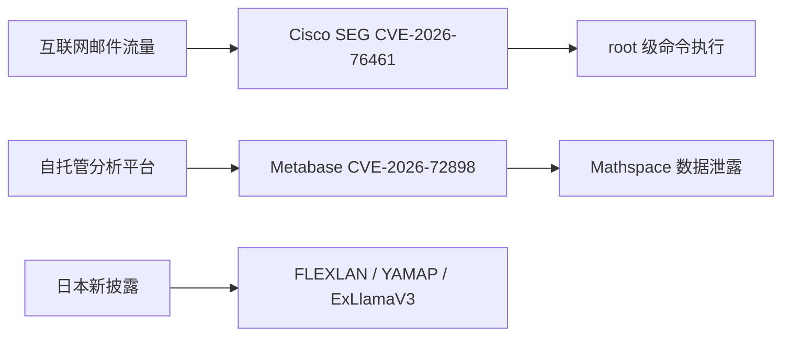

## 今日概要

9 月 14 日最需要立即处置的是 Cisco Secure Email Gateway 的 CVE-2026-76461。该漏洞位于 AsyncOS 邮件解析流程，攻击者无需认证，只需让恶意构造的邮件经过受影响设备，即可注入 SQL 并进一步以 root 权限执行任意命令。Cisco PSIRT 已确认实际攻击，CISA 也在同日将其加入 KEV。

当天另外出现两类值得跟进的现实事件：Mathspace 披露超过 100 万人受影响的数据泄露，攻击链涉及此前已知的 Metabase SQL 注入漏洞 CVE-2026-72898；IDScan.net 的身份验证数据事件仍在调查，已确认可能涉及姓名与政府签发证件号码，但暗网声称的超大规模数据量仍不能等同于厂商确认范围。

日本侧的新增披露以设备和本地软件为主。JVN 更新了 CONTEC FLEXLAN 系列多漏洞信息，并发布 YAMAP Android 应用访问控制问题以及 ExLlamaV3 CUDA 扩展的越界访问 DoS 风险。

## 今日风险路径

> 图：9 月 14 日主要风险路径。仅基于本文已验证事件整理。

## 重点关注

### Cisco Secure Email Gateway CVE-2026-76461：已确认在野利用的未认证 root RCE

> 这是当天优先级最高的新事件：攻击面位于邮件网关本身，利用无需认证，并且成功后可直接在底层系统以 root 权限执行命令。

**Severity:** Critical  
**Status:** 已确认在野利用 / CISA KEV  
**CVSS:** 9.8  
**CVE:** CVE-2026-76461  
**Affected:** Cisco Secure Email Gateway / AsyncOS

Cisco 表示，该问题源于邮件解析逻辑中的输入验证不足。攻击者可向经由受影响设备处理的邮件中嵌入恶意 SQL，成功后不仅可执行任意 SQL，还可进一步触发底层操作系统的 root 级命令执行。Cisco PSIRT 已明确确认 2026 年 9 月存在 active exploitation，加拿大 Cyber Centre 同日指出 CISA 已将其纳入 KEV。

#### 影响

邮件安全网关通常位于高信任网络边界，能够接触大规模入站邮件、隔离区、策略与管理凭据。一旦被攻陷，风险不仅是设备本身失陷，还可能演变成邮件监控、凭据窃取、内部横向移动和长期持久化。

#### 建议

- 立即升级到 Cisco 公布的修复版本：15.5.5-014、16.0.4-302、16.5.0-780 或对应更高安全版本。
- Cisco 明确表示没有可替代补丁的 workaround，不应以配置规避代替升级。
- 检查邮件网关异常进程、未知 root 级命令、异常持久化、管理账号变化以及近期异常出站通信。
- 若发现可疑入侵迹象，应按高权限边界设备失陷处理，轮换管理凭据并评估重建设备。

#### Sources

- [Cisco — Secure Email Gateway SQL Injection Vulnerability](https://www.cisco.com/c/en/us/support/docs/csa/cisco-sa-esa-inj-2bLVGmhX.html)
- [Canadian Centre for Cyber Security — AV26-921](https://www.cyber.gc.ca/en/alerts-advisories/cisco-security-advisory-av26-921)
- [CISA Known Exploited Vulnerabilities Catalog](https://www.cisa.gov/known-exploited-vulnerabilities-catalog)

### Cisco Secure Email hardening release：同一平台另修复多组高危缺陷

**Severity:** High  
**Status:** 暂无除 CVE-2026-76461 外的独立在野利用证据  
**CVE:** CVE-2026-20353、CVE-2026-76440、CVE-2026-76441、CVE-2026-76442、CVE-2026-76443  
**Affected:** Cisco Secure Email Gateway / Secure Email and Web Manager

Cisco 同日发布配套 hardening release，覆盖路径遍历、访问控制、资源生命周期控制、输入验证以及注入类问题，其中多个类别最高 CVSS 达 9.8。Cisco 表示这些问题来自内部安全测试，并提到现有测试流程结合了 frontier AI models。

#### 建议

已经因为 CVE-2026-76461 安排紧急维护的环境，应一次性升级到 hardening release 覆盖的修复版本，而不是只处理单个 CVE。这样可以避免完成一次高成本邮件网关维护后，仍残留同批次高危问题。

#### Sources

- [Cisco — Secure Email Gateway and Secure Email and Web Manager Security Hardening Release](https://www.cisco.com/c/en/us/support/docs/csa/cisco-sa-hardening-esa-dfCrfXkm.html)

## 已确认现实攻击

### Mathspace：攻击者利用 Metabase CVE-2026-72898 访问内部报表数据库

**Severity:** High  
**Status:** 已确认漏洞利用导致数据泄露  
**CVE:** CVE-2026-72898  
**Affected:** 自托管 Metabase / Mathspace 内部分析环境

Check Point Research 的 9 月 14 日周报指出，澳大利亚和新西兰教育平台 Mathspace 遭遇数据泄露，影响超过 100 万人。攻击者利用自托管 Metabase 中的 CVE-2026-72898 SQL 注入漏洞访问内部 reporting database，暴露数据包括姓名、邮箱、用户名和位置等信息。

韩国 KrCERT 此前已经针对该组 Metabase 漏洞发布安全更新建议，并明确指出近期已经发生利用相关漏洞的攻击和受害事件。

#### 建议

- Metabase 自托管实例升级到对应修复分支，例如 x.63.5、x.62.9、x.61.11、x.60.17 或更高安全版本。
- 检查数据库访问日志、应用查询历史以及异常大批量读取行为。
- 若分析平台能够访问其他生产数据源，应重新审计其数据库权限，避免 BI/报表系统成为跨系统数据入口。

#### Sources

- [Check Point Research — 14th September Threat Intelligence Report](https://research.checkpoint.com/2026/14th-september-threat-intelligence-report/)
- [KrCERT — Metabase 产品安全更新建议](https://www.krcert.or.kr/kr/bbs/view.do?bbsId=B0000133&menuNo=205020&nttId=72178)

## 数据泄露与身份风险

### IDScan.net：身份验证云数据事件仍在扩大调查范围

**Severity:** High  
**Status:** 已确认未授权访问风险，最终影响范围仍在调查  
**Affected:** IDScan.net customer cloud accounts

IDScan.net 表示其在 9 月 1 日收到信息，显示某些客户云账户中的数据可能被未授权第三方访问或复制；厂商确认潜在数据类别包括姓名、驾驶证号和其他政府签发证件号码。FBI 也在调查与大量美国、加拿大驾驶证记录有关的公开报告。

需要特别区分：暗网服务宣称掌握超过 1.5 亿份驾驶证记录，但该数字并不是 IDScan.net 已完成取证后确认的受影响人数，因此不应把 marketplace claim 写成确定事实。

#### 建议

- 受影响组织关注厂商后续通知，确认自身上传或托管的数据类别。
- 对涉及政府身份证件的用户，提高账户恢复、开户和高风险身份验证流程的二次校验强度。
- 个人用户应特别警惕基于真实姓名与证件信息构造的高可信钓鱼和身份欺诈。

#### Sources

- [IDScan.net — Notification of Data Security Incident](https://idscan.net/press-release/notification-of-data-security-incident/)
- [Reuters — FBI probes report of exposed driver licenses](https://www.reuters.com/world/us/fbi-says-it-is-investigating-report-that-millions-us-drivers-licenses-exposed-2026-09-02/)

## 日本 / 区域性安全更新

### CONTEC FLEXLAN：多项高危命令执行、路径遍历和缓冲区问题

**Severity:** High  
**Status:** 暂无可靠在野利用证据  
**CVE:** CVE-2026-82762 至 CVE-2026-82772  
**Affected:** 多个 CONTEC FLEXLAN 无线 LAN 系列

JVN 在 9 月 14 日更新 FLEXLAN 系列漏洞信息。漏洞覆盖 OS command injection、XSS、CSRF、path traversal 与 buffer overflow，其中部分问题 CVSS 3.1 达 8.8；某些型号在满足登录或网络访问条件时可导致任意 OS 命令或程序执行。

#### 建议

使用 FX5000、FX4000、FX3000、SGA1000、RP-WAH-SR、EC1000 等相关系列的组织应对照 JVN 列出的型号和固件版本，升级到厂商最新固件，并限制管理平面的网络访问。

#### Sources

- [JVN — CONTEC FLEXLAN 系列多漏洞](https://jvn.jp/vu/JVNVU99009004/index.html)

### YAMAP Android：应用内浏览器来源验证不足

**Severity:** Medium  
**Status:** 暂无在野利用证据  
**CVSS:** 5.4 (v3) / 5.1 (v4)  
**CVE:** CVE-2026-85125  
**Affected:** YAMAP Android v17.1.0 及以前

该问题会影响应用内浏览器的通信来源验证。成功利用可能导致应用内信息泄露，或者将用户导向非预期网站；利用需要用户交互。

**建议：**升级 YAMAP Android 到最新版。

#### Sources

- [JVN iPedia — CVE-2026-85125](https://jvndb.jvn.jp/ja/contents/2026/JVNDB-2026-000131.html)

### ExLlamaV3 CVE-2026-84286：CUDA 扩展越界访问可触发 DoS

**Severity:** Medium  
**Status:** 暂无在野利用证据  
**CVE:** CVE-2026-84286  
**Affected:** ExLlamaV3 `exllamav3_ext`

CERT/CC 披露 `exllamav3_ext` CUDA 扩展存在输入验证不足，攻击者可通过构造参数触发负数数组索引和非法 GPU memory access，造成进程崩溃或不稳定状态。该问题值得 AI 推理基础设施关注，因为下游项目如果打包了受影响扩展，也会继承风险。

#### 建议

- 更新到包含上游修复的 ExLlamaV3 版本或应用官方合并补丁。
- 下游项目应重新构建依赖并确认部署包没有继续携带旧版扩展。
- 对处理不可信模型或外部输入的推理服务，增加 worker 隔离和自动重启限制，避免 DoS 扩大为服务级故障。

#### Sources

- [CERT/CC VU#369611](https://kb.cert.org/vuls/id/369611)
- [JVN — JVNVU#94022278](https://jvn.jp/vu/JVNVU94022278/index.html)

## 今日观察

- **邮件安全设备再次证明“安全产品本身也是高价值入口”。** Cisco SEG 位于邮件边界，而且本次漏洞无需认证即可触发 root 级命令执行，修复优先级应明显高于普通应用漏洞。
- **数据分析平台越来越像新的数据出口。** Mathspace 事件说明自托管 BI/analytics 工具往往拥有对内部数据库的广泛读取权限，一旦被攻陷，影响可能远大于平台自身。
- **日本当天新增披露没有必要被全球媒体热度牵着走。** FLEXLAN、YAMAP 和 ExLlamaV3 都不属于全球头条，但对于对应产品用户仍然具有明确操作价值。
- **对泄露规模保持证据分级。** IDScan 事件中的暗网数据量应继续作为未经厂商最终确认的 claim，而不是事实统计。

---
Generated by ChatGPT | GPT-5.6 Sol
