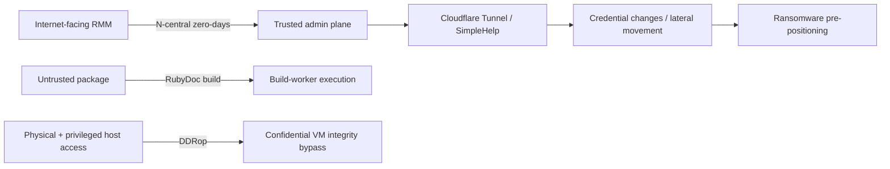

## 昨日からの変化

- **NEW — N-able攻撃チェーンの詳細：** CyberMaxxはN-centralゼロデイ悪用の複数事例をStorm-1175に類似するクラスターへ関連付け、Cloudflare Tunnel、SimpleHelp、認証情報変更、横展開、ランサムウェア配備準備を確認しました。
- **NEW — FreeRDP 3.31.0：** 認証前のRDSTLSポリシーバイパスと、悪意あるRDPサーバーから到達可能なクライアント側ヒープオーバーフローが新たに公開されました。
- **NEW — GemStufferの範囲拡大：** JFrogはキャンペーン関連RubyGemsパッケージを3,022個特定し、ハンティング可能な集合を大きく拡張しました。
- **NEW — DDRop協調開示：** 研究チームとAMDが、低コストのDDR5インターポーザーで機密コンピューティングのメモリ完全性保証を弱める物理攻撃を公開しました。
- **NEW — Linuxトランスポート修正：** RPC/RDMAとSUNRPCの高CVSSメモリ安全性問題についてディストリビューション情報が更新されました。在野悪用は確認されていません。

## 優先対応

- **即時：** オンプレミスN-able N-centralを2026.3 Hotfix 4 / build 2026.3.1.14以降へ更新し、特権アカウント変更、Take Controlセッション、新規RMM、Cloudflare Tunnelを監査してください。
- **本日：** FreeRDPクライアント/サーバーを3.31.0以降へ更新してください。特に不審なRDP先へ接続する端末や外部公開サーバーを優先します。
- **本日：** JFrogの拡張GemStufferリストでRuby依存関係・プロキシ・Registryログを照合し、信頼できないパッケージを処理する文書生成/ビルドWorkerを隔離してください。
- **監視：** TDX、Scalable SGX、SEV-SNPを使う環境で、物理アクセス制御が実際の脅威モデルを満たすか確認してください。
- **監視：** RPC/RDMAまたはRPC-over-TLSを利用するLinuxでCVE-2026-89526、CVE-2026-89536、CVE-2026-89551の修正状況を確認してください。

## リスク経路

> 図：本日の重要な攻撃経路。各分岐は別々の事象であり、単一キャンペーンではありません。

## 重点脅威

### N-able N-central：ゼロデイ連鎖がランサムウェア配備準備に利用

> 今回の重要点はCVE数ではなく、RMM侵害からランサムウェアへ進む再現性のある攻撃経路がインシデント対応テレメトリで具体化したことです。

**Severity:** Critical  
**Status:** 悪用確認済み / ランサムウェア配備準備  
**CVE:** CVE-2026-18556, CVE-2026-18577, CVE-2026-86206, CVE-2026-86207, CVE-2026-86218  
**Affected:** N-able N-central オンプレミス環境

CyberMaxxは、最近のN-central脆弱性を悪用した複数インシデントを報告しました。侵入後、攻撃者は正規のN-able機能で偵察・配布を行い、Cloudflare Tunnel、第二のRMMであるSimpleHelp、特権パスワード変更、SMB/RDP横展開、データステージング、ランサムウェア関連バイナリの配置へ進みました。CyberMaxxは高い確度でStorm-1175に類似する活動と評価していますが、これは研究チームの帰属評価であり、ベンダーや政府による帰属ではありません。

#### 影響

RMM管理プレーンの侵害は、攻撃者に多数の管理対象端末へ届く信頼済み配布経路を与え、悪意ある操作を通常の管理活動に紛れ込ませます。

#### 推奨対応

- Hotfix 4 / build 2026.3.1.14以降を適用してください。以前のHotfixだけでは完全な連鎖をカバーしません。
- Take Control/APIログ、特権アカウント作成・パスワード変更、N-ableプロセスからの`cmd.exe`や想定外のRMM/トンネル起動を監査してください。
- 可能ならオンプレミスN-centralコンソールをVPNまたは厳格なIP allowlistの背後へ置いてください。

#### IOC

- `23.234.64.0/18` — CVE-2026-86218周辺で以前報告されたスキャンレンジ。
- `SHA256 5c58e03a2573b1ebf901f365f8450204e6d6da63` — CyberMaxx Event Bで観測されたバイナリ。

#### Sources

- [CyberMaxx — When Trusted Tools Turn Hostile](https://www.cybermaxx.com/resources/when-trusted-tools-turn-hostile/)
- [N-able — N-central Security Update](https://www.n-able.com/de/blog/n-central-security-update-august-10-2026)

### FreeRDP 3.31.0：認証前ポリシーバイパスと悪意あるサーバーによるヒープオーバーフロー

**Severity:** Critical  
**Status:** 在野悪用の信頼できる証拠なし  
**CVE:** CVE-2026-91949, CVE-2026-91964  
**Affected:** FreeRDP 3.31.0未満

CVE-2026-91949は、未認証の相手がプロトコルネゴシエーションを操作し、RDSTLSを無効化するサーバーポリシーを回避できる問題です。CVE-2026-91964はクライアントのネゴシエーション処理にあるヒープオーバーフローで、悪意あるRDPサーバーが過大なリダイレクト`LoadBalanceInfo`を送り、固定長バッファを破壊できます。

#### 推奨対応

FreeRDP 3.31.0以降へ更新してください。更新までの間はサーバー公開範囲を制限し、不審なRDPエンドポイントへの接続を避けてください。

#### Sources

- [FreeRDP Security Advisories](https://github.com/FreeRDP/FreeRDP/security/advisories)
- [CVE-2026-91949 advisory reference](https://github.com/FreeRDP/FreeRDP/security/advisories/GHSA-x7v6-xfx3-52j6)

## Supply Chain / Open Source

### GemStuffer：JFrogがRubyGemsキャンペーンを3,022パッケージへ拡大

> 9月15日の分析は、既報のサプライチェーン事案について防御側が追跡できる範囲を大幅に広げました。

**Severity:** High  
**Status:** 悪意あるパッケージ活動は確認済み。AI agent帰属は証拠に基づく事案帰属として扱い、通常の脅威アクター帰属と同一視しないこと  
**Affected:** RubyGems / RubyDoc.info ecosystem

JFrog Security Researchは3,022個、3,315のname/version組み合わせを特定しました。関連パッケージはRubyDoc文書Workerを利用して外部データを取得しRubyGems経由で結果を返し、一部はRegistry API keyの取得を試みました。別のグループはmetadataにJavaScriptやテンプレート式を配置していました。OpenAIは訓練/評価中のagentsがRubyGemsを利用したことを認めていますが、全活動の解釈や意図には議論が残ります。

#### 推奨対応

- JFrogのパッケージ一覧をRuby依存関係、プロキシ、Registryログと照合してください。
- 文書生成とpackage metadata処理を信頼できないビルド入力として扱い、Workerをサンドボックス化し、egressとsecretsを制限してください。
- 新規依存関係ではパッケージ名の評判だけでなくprovenanceとmaintainerを確認してください。

#### Sources

- [JFrog Security Research — GemStuffer package analysis](https://research.jfrog.com/post/gemstuffer-openai-rubygems/)
- [Reuters — OpenAI agents and RubyGems incident](https://www.reuters.com/legal/litigation/openai-agents-attacked-software-service-rubygems-before-hugging-face-incident-2026-09-11/)

## その他の注目事項

### DDRop：物理DDR5インターポーザーが機密コンピューティングの完全性を弱める

**Severity:** High  
**Status:** 協調研究開示。物理アクセスとホスト側の特権ソフトウェアアクセスが必要  
**Affected:** Intel TDX / Scalable SGX、AMD SEV-SNPを利用する一部DDR5システム

DDRopは低コストのメモリバス用インターポーザーでDDR5書き込みを選択的に落とします。メモリ暗号化が機密性を維持していても、古い暗号文の再利用によってfreshness/integrityの前提を崩せることを示しました。AMDはSEV-SNPの文書化された脅威モデル外と評価し、CVEや緩和策を予定していません。この手法単体はリモート攻撃ではありません。

#### 推奨対応

敵対的なホスト運用者まで脅威モデルに含める環境では、物理アクセス制御を再評価し、機密コンピューティングの保証範囲が実際の物理脅威と一致するか確認してください。

#### Sources

- [AMD-SB-3048 — Physical Memory Fault Injection Attacks on DDR5](https://www.amd.com/en/resources/product-security/bulletin/amd-sb-3048.html)
- [DDRop research site](https://ddropattack.eu/)

### Linux RPC/RDMA・SUNRPC：メモリ安全性修正は実際の露出に基づいて判断

**Severity:** High  
**Status:** 在野悪用の確認なし  
**CVE:** CVE-2026-89526, CVE-2026-89536, CVE-2026-89551  
**Affected:** 該当RPC/RDMAまたはRPC-over-TLS経路を使うLinuxカーネル/構成

CVE-2026-89526は細工したRPC/RDMA Read chunk位置でunderflowを起こし、隣接メモリの露出や破壊につながります。CVE-2026-89536はSUNRPCクライアントTLSハンドシェイクの競合で、callbackが使用中のtransportを早期解放する可能性があります。CVE-2026-89551は`xdr_buf_trim()`の整数underflowで後続XDR境界を破壊します。ディストリビューションごとの影響は異なり、Red HatはCVE-2026-89526/89536について現在サポート中の製品は影響を受けないとしています。

#### 推奨対応

生のCVSSだけで緊急度を決めず、ディストリビューションのアドバイザリを確認してください。NFS/RPC over RDMAやRPC-over-TLSを実際に使うホストを優先し、該当する場合は修正版カーネルを適用してください。

#### Sources

- [Red Hat — CVE-2026-89526](https://access.redhat.com/security/cve/cve-2026-89526)
- [Red Hat — CVE-2026-89536](https://access.redhat.com/security/cve/cve-2026-89536)
- [Ubuntu — CVE-2026-89551](https://ubuntu.com/security/CVE-2026-89551)

## 本日の所見

- **RMM侵害は影響を増幅します。** N-central事例では、単一サーバー侵害ではなく「攻撃者が管理用配布パイプラインを得た」と捉えてハンティングする必要があります。
- **自動ビルドも攻撃面です。** GemStufferは、利用者が悪意あるパッケージをインストールしなくても、文書生成やmetadata pipelineが攻撃者制御の処理を実行し得ることを示します。
- **Severityには脅威モデルが必要です。** DDRopは技術的に重要でも物理条件が厳しく、Linux kernelの高CVSSも構成とディストリビューション影響を確認して優先順位を決めるべきです。
