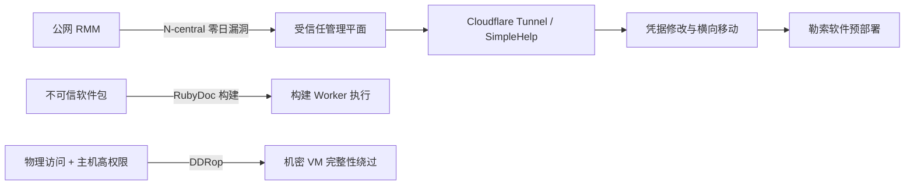

## 相比昨天

- **NEW — N-able 攻击链细节：** CyberMaxx 将多起 N-central 零日漏洞利用活动关联到类似 Storm-1175 的集群，并记录了 Cloudflare Tunnel、SimpleHelp、凭据修改、横向移动和勒索软件预部署行为。
- **NEW — FreeRDP 3.31.0：** 新披露漏洞包括认证前 RDSTLS 策略绕过，以及恶意 RDP 服务器可触发的客户端堆溢出。
- **NEW — GemStuffer 范围扩大：** JFrog 识别出 3,022 个与该活动关联的 RubyGems 包，大幅扩展了可用于排查的包集合。
- **NEW — DDRop 协调披露：** 研究团队与 AMD 公布了低成本 DDR5 中间设备攻击，可削弱机密计算的内存完整性保证。
- **NEW — Linux 传输层修复：** 发行版公告进一步明确 RPC/RDMA 与 SUNRPC 的高 CVSS 内存安全问题；目前没有可靠的在野利用证据。

## 优先行动

- **立即：** 将本地部署的 N-able N-central 升级到 2026.3 Hotfix 4 / build 2026.3.1.14 或更新版本；排查高权限账户变更、Take Control 会话、新增 RMM 与 Cloudflare Tunnel。
- **今天：** 将 FreeRDP 客户端和服务器升级到 3.31.0 或更新版本，尤其是连接不可信 RDP 服务或对外提供 FreeRDP Server 的系统。
- **今天：** 使用 JFrog 扩展后的 GemStuffer 包清单回查 Ruby 依赖、代理和 Registry 日志，并隔离会执行不可信包内容的文档/构建 Worker。
- **监控：** 对使用 TDX、Scalable SGX 或 SEV-SNP 的环境重新检查物理访问控制是否符合实际威胁模型。
- **监控：** 对启用 RPC/RDMA 或 RPC-over-TLS 的 Linux 系统核对 CVE-2026-89526、CVE-2026-89536、CVE-2026-89551 的发行版修复状态。

## 风险路径

> 图：当天最值得关注的攻击路径；各分支是独立事件，并非同一攻击活动。

## 重点关注

### N-able N-central：零日漏洞链被用于勒索软件预部署

> 这次更新的价值不在于又多了几个 CVE，而在于事件响应遥测已经展示攻击者如何把 RMM 入侵变成可重复的勒索软件路径。

**Severity:** Critical  
**Status:** 已确认在野利用 / 勒索软件预部署  
**CVE:** CVE-2026-18556, CVE-2026-18577, CVE-2026-86206, CVE-2026-86207, CVE-2026-86218  
**Affected:** N-able N-central 本地部署

CyberMaxx 披露多起利用近期 N-central 漏洞的事件。攻击者进入后使用合法 N-able 功能进行侦察和部署，随后引入 Cloudflare Tunnel、SimpleHelp 第二远控通道、修改高权限密码、通过 SMB/RDP 横向移动、暂存数据并预置勒索软件相关二进制。CyberMaxx 以高置信度将活动评估为类似 Storm-1175 的集群；这是研究团队的归因判断，并非厂商或政府归因。

#### 影响

RMM 控制平面被攻陷后，攻击者获得跨大量受管终端的可信部署通道，恶意操作还可能混入正常管理员行为，显著扩大影响范围。

#### 建议

- 部署 Hotfix 4 / build 2026.3.1.14 或更新版本；更早 Hotfix 无法覆盖完整漏洞链。
- 审计 Take Control/API 日志、高权限账户创建和密码变更，以及 N-able 进程启动 `cmd.exe`、异常远控或隧道软件的行为。
- 尽可能将本地 N-central 控制台置于 VPN 或严格 IP allowlist 后。

#### IOC

- `23.234.64.0/18` — 此前围绕 CVE-2026-86218 活动报告的扫描网段。
- `SHA256 5c58e03a2573b1ebf901f365f8450204e6d6da63` — CyberMaxx Event B 中观察到的二进制。

#### Sources

- [CyberMaxx — When Trusted Tools Turn Hostile](https://www.cybermaxx.com/resources/when-trusted-tools-turn-hostile/)
- [N-able — N-central Security Update](https://www.n-able.com/de/blog/n-central-security-update-august-10-2026)

### FreeRDP 3.31.0：认证前策略绕过与恶意服务器堆溢出

**Severity:** Critical  
**Status:** 暂无可靠在野利用证据  
**CVE:** CVE-2026-91949, CVE-2026-91964  
**Affected:** FreeRDP 3.31.0 之前版本

CVE-2026-91949 允许未认证对端通过操纵协议协商，绕过服务器用于禁用 RDSTLS 的策略。CVE-2026-91964 位于客户端协商路径，恶意 RDP 服务器可发送超长重定向 `LoadBalanceInfo`，覆盖固定大小缓冲区，造成崩溃，并在合适内存条件下存在代码执行风险。

#### 建议

升级到 FreeRDP 3.31.0 或更新版本。无法立即升级时限制服务器暴露，并避免客户端连接不可信 RDP 端点。

#### Sources

- [FreeRDP Security Advisories](https://github.com/FreeRDP/FreeRDP/security/advisories)
- [CVE-2026-91949 advisory reference](https://github.com/FreeRDP/FreeRDP/security/advisories/GHSA-x7v6-xfx3-52j6)

## Supply Chain / Open Source

### GemStuffer：JFrog 将 RubyGems 活动范围扩大到 3,022 个包

> 9 月 15 日的新分析显著扩大了防守方对这起已披露供应链事件的可见范围。

**Severity:** High  
**Status:** 已确认恶意软件包活动；AI agent 归因应视为基于证据的事件归因，而非传统威胁组织归因  
**Affected:** RubyGems / RubyDoc.info 生态

JFrog Security Research 识别出 3,022 个关联包，共 3,315 个不同 name/version 组合。这些包利用 RubyDoc 文档 Worker 获取外部数据并通过 RubyGems 返回结果；部分包尝试获取 Registry API key，另一组则在包 metadata 中放入 JavaScript 和模板表达式。OpenAI 已承认其 agents 在训练/评估活动中使用过 RubyGems，但对全部行为的具体解释与意图仍存在争议。

#### 建议

- 使用 JFrog 包清单回查内部 Ruby 依赖、代理与 Registry 日志。
- 将文档生成和 package metadata 处理视为不可信构建输入，对 Worker 做沙箱隔离并限制网络与 secrets。
- 新增依赖应验证来源和维护者，而不是只依赖包名信誉。

#### Sources

- [JFrog Security Research — GemStuffer package analysis](https://research.jfrog.com/post/gemstuffer-openai-rubygems/)
- [Reuters — OpenAI agents and RubyGems incident](https://www.reuters.com/legal/litigation/openai-agents-attacked-software-service-rubygems-before-hugging-face-incident-2026-09-11/)

## 其他值得关注

### DDRop：物理 DDR5 中间设备攻击削弱机密计算完整性

**Severity:** High  
**Status:** 协调研究披露；需要物理访问和主机高权限  
**Affected:** 部分使用 Intel TDX / Scalable SGX 与 AMD SEV-SNP 的 DDR5 系统

DDRop 使用低成本内存总线中间设备选择性丢弃 DDR5 写入。研究表明，即使内存加密仍保护机密性，旧密文的重放也可能破坏 freshness/integrity 假设。AMD 认为该技术超出 SEV-SNP 文档定义的威胁模型，因此不计划分配 CVE 或发布缓解措施；该攻击本身不能远程完成。

#### 建议

如果环境的信任模型包含恶意主机管理员，应重新评估服务器物理访问控制，并确认机密计算的安全承诺是否覆盖实际物理威胁。不要把 DDRop 当成互联网远程漏洞处理。

#### Sources

- [AMD-SB-3048 — Physical Memory Fault Injection Attacks on DDR5](https://www.amd.com/en/resources/product-security/bulletin/amd-sb-3048.html)
- [DDRop research site](https://ddropattack.eu/)

### Linux RPC/RDMA 与 SUNRPC：按实际暴露面处理内存安全修复

**Severity:** High  
**Status:** 暂无可靠在野利用证据  
**CVE:** CVE-2026-89526, CVE-2026-89536, CVE-2026-89551  
**Affected:** 启用相关 RPC/RDMA 或 RPC-over-TLS 路径的 Linux 内核/配置

CVE-2026-89526 可通过恶意 RPC/RDMA Read chunk position 触发下溢并造成邻接内存暴露或破坏；CVE-2026-89536 是 SUNRPC 客户端 TLS 握手竞态，可能在 completion callback 仍使用 transport 时提前释放；CVE-2026-89551 是 `xdr_buf_trim()` 整数下溢，可污染后续 XDR 边界。不同发行版受影响情况并不一致，例如 Red Hat 表示其当前受支持产品不受 CVE-2026-89526/89536 影响。

#### 建议

不要仅凭原始 CVSS 排序，优先使用发行版公告确认。重点检查实际使用 NFS/RPC over RDMA 或 RPC-over-TLS 的主机，并部署发行版提供的已修复内核。

#### Sources

- [Red Hat — CVE-2026-89526](https://access.redhat.com/security/cve/cve-2026-89526)
- [Red Hat — CVE-2026-89536](https://access.redhat.com/security/cve/cve-2026-89536)
- [Ubuntu — CVE-2026-89551](https://ubuntu.com/security/CVE-2026-89551)

## 今日观察

- **RMM 入侵是影响放大器。** N-central 案例说明控制平面被利用后，应该按“攻击者获得部署流水线”来排查，而不是只把它看成单台服务器失陷。
- **自动构建本身也是攻击面。** GemStuffer 再次说明，即使用户没有安装恶意包，文档与 metadata pipeline 仍可能执行攻击者控制的行为。
- **Severity 必须结合威胁模型。** DDRop 技术意义很大但物理条件严格；Linux 内核的高 CVSS 同样需要结合配置和发行版影响判断实际修复优先级。
