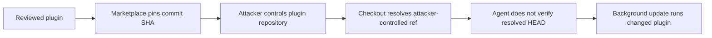

## Changes since yesterday

- **NEW — WaterPlum:** Japan's National Police Agency and international partners publicly attributed the fake-recruitment activity also tracked as Contagious Interview to North Korea. Their investigation covers more than 30,000 infected devices across more than 100 countries and regions.
- **NEW — Plugin4Shell:** AIR published a plugin SHA-pinning bypass affecting Claude Code, Codex, GitHub Copilot and Gemini CLI. Claude Code 2.1.179 and Codex 0.146.0 contain fixes; AIR reports no GitHub Copilot fix and recommends Gemini CLI users migrate to Antigravity.
- **NEW — Check Point:** CVE-2026-91843 allows unauthenticated remote code execution as root on affected Security Management and Log Servers. Check Point says it has not observed exploitation.
- **NEW — Microsoft cloud:** Microsoft disclosed CVE-2026-85889 in Azure AI Foundry with a CVSS score of 10.0. The hosted service has already been mitigated and Microsoft reports no known exploitation.
- **NEW — APT36:** Zscaler documented Operation RapidRust, including RUSTYSHADE, RUSTYMOVE, PSNATCH and BASHNATCH against government and defense targets in India and Afghanistan.

## Priority actions

- **Immediate:** Apply Check Point LivePatch `sk1000155` to affected Security Management and Log Servers and restrict Trusted Clients to known administrative hosts.
- **Immediate:** Update Claude Code to 2.1.179 or later and Codex to 0.146.0 or later where marketplace plugins are enabled. Treat unpatched plugin clients as unable to guarantee SHA-pinned code identity.
- **Today:** Development teams should reject unsolicited coding-test projects and package-install instructions received through recruiting channels; review developer systems for WaterPlum malware families if such material was executed.
- **Today:** Indian and Afghan government or defense environments should hunt for RapidRust tooling, private-GitHub C2 activity, suspicious removable-media staging and typosquatted news domains.
- **Monitor:** Azure AI Foundry customers do not need to patch CVE-2026-85889 because Microsoft mitigated it server-side; retain the disclosure for incident-history and exposure reviews.

## Priority threats

### WaterPlum fake-recruitment campaign receives joint public attribution

**Severity:** High  
**Status:** Confirmed malicious campaign; public attribution  
**Threat actor:** WaterPlum / Contagious Interview  
**Malware:** BeaverTail, InvisibleFerret, OtterCookie and related tooling  
**Affected:** IT workers and developers targeted through recruiting and coding-test lures

On September 18, Japan's National Police Agency and National Cybersecurity Office published a joint attribution with U.S., Australian and German partners. The agencies link WaterPlum to North Korea and describe fake recruiting approaches that direct developers to run malicious projects or coding assignments.

The investigation covers activity from December 2025 through July 2026. Japanese authorities report more than 30,000 infected devices across more than 100 countries and regions, information associated with more than 7,000 cryptocurrency wallets, and at least ¥1.7 billion in cryptocurrency transferred to wallets controlled by the group.

#### Recommendations

- Treat coding tests and recruiter-supplied repositories as untrusted code. Inspect dependency manifests and scripts before execution and use an isolated environment without production, cloud or wallet credentials.
- Review developer endpoints that executed unsolicited interview projects for credential theft, persistence and wallet access.
- Verify recruiters and employers through independently obtained contact details before running supplied code.

#### Sources

- [Japan National Police Agency — Public attribution concerning WaterPlum and North Korean IT workers](https://www.npa.go.jp/news/release/2026/20260918001.html)

### Plugin4Shell bypasses plugin SHA pinning in major coding agents

**Severity:** High  
**Status:** Vendor-coordinated disclosure; fixes vary by client  
**Affected:** Claude Code, OpenAI Codex, GitHub Copilot and Gemini CLI plugin/marketplace workflows

AIR Security found that affected agents could request a pinned Git commit without verifying that the resulting working tree actually resolved to that commit. For Claude Code, Codex and GitHub Copilot, a repository controlled by an attacker can exploit Git reference resolution where a hosting service permits a branch named like the pinned SHA. AIR describes a separate `FETCH_HEAD` resolution path in Gemini CLI.

Background plugin updates make the issue zero-click after a vulnerable plugin or marketplace entry is already installed. The resulting plugin executes with the permissions available to the coding agent.

The missing post-checkout identity verification is the control failure in the published attack chain.

#### Recommendations

- Update Claude Code to 2.1.179 or later and Codex to 0.146.0 or later.
- AIR reports that GitHub Copilot had no fix at publication time. Disable or tightly restrict marketplace plugins where the client cannot verify the resolved commit.
- AIR reports Gemini CLI is deprecated and will not receive a fix; migrate affected workflows to Google's recommended replacement.
- For internal plugin tooling, verify `git rev-parse HEAD` against the expected pinned commit after checkout and fail closed on mismatch.

#### Sources

- [AIR Security — Plugin4Shell](https://www.air.security/blog-posts/plugin4shell)

### Check Point management servers: CVE-2026-91843 permits unauthenticated root RCE

**Severity:** Critical  
**Status:** Patched; no confirmed exploitation  
**CVSS:** 9.8  
**CVE:** CVE-2026-91843  
**Affected:** Check Point Security Management, Multi-Domain Security Management and Log Server releases listed in `sk1000155`

Check Point describes a stack-based buffer overflow reachable during the unauthenticated login process. Successful exploitation can execute arbitrary code as root. Exposure depends in part on the Trusted Clients configuration controlling which hosts can reach management services.

Check Point distributed the fix through LivePatch and says customers with automatic updates enabled are protected. The vendor states that it has no indication of exploitation in the wild.

#### Recommendation

Apply LivePatch `sk1000155`, verify that the patch is active, and restrict Trusted Clients to specific administrative systems rather than broad network ranges. End-of-support releases should follow Check Point's supported remediation path.

#### Sources

- [Check Point — Critical Security Update CVE-2026-91843](https://community.checkpoint.com/t5/General-Topics/Important-Notification-Action-required-Critical-Security-Update/m-p/282409)
- [NHS England — CC-4854](https://digital.nhs.uk/cyber-alerts/2026/cc-4854)

## Other notable items

### Azure AI Foundry CVE-2026-85889 was mitigated server-side

**Severity:** Critical  
**Status:** Mitigated by Microsoft; no known exploitation  
**CVSS:** 10.0  
**CVE:** CVE-2026-85889  
**Affected:** Azure AI Foundry hosted service

Microsoft assigned CVE-2026-85889 to missing authentication for a critical Azure AI Foundry function. The CVSS vector is network reachable, requires no privileges or user interaction, and carries high confidentiality, integrity and availability impact with changed scope.

Microsoft reports that the cloud service has already been mitigated. Customers do not need to deploy a patch or workaround, and the vendor reports no known exploitation or public exploit code at disclosure.

#### Recommendation

No customer patch is required. Preserve relevant cloud audit and identity logs according to normal retention policy and review them if there is an independent indication of suspicious Foundry access during the pre-mitigation period.

#### Sources

- [Microsoft Security Response Center — CVE-2026-85889](https://msrc.microsoft.com/update-guide/vulnerability/CVE-2026-85889)

### APT36 Operation RapidRust targets government and defense networks

**Severity:** High  
**Status:** Confirmed cyber-espionage campaign  
**Threat actor:** APT36 / Transparent Tribe  
**Malware:** RUSTYSHADE, RUSTYMOVE, PSNATCH, BASHNATCH  
**Affected:** Government and defense organizations in India and Afghanistan observed by Zscaler

Zscaler ThreatLabz observed the campaign in August 2026. RUSTYSHADE is a Rust backdoor that uses attacker-controlled private GitHub repositories for C2 and AES-256-GCM for encrypted communications. RUSTYMOVE copies pre-staged malicious files to removable media, providing a path toward isolated networks. PSNATCH and BASHNATCH collect selected files on Windows and Linux respectively.

ThreatLabz also observed typosquatted Indian news domains used to stage PowerShell content and post-compromise attempts to identify local systems and network shares.

#### Recommendations

- Hunt for the IOC set and malware hashes published by Zscaler, plus unusual GitHub access from systems that do not normally use private repositories.
- Inspect removable-media activity on sensitive workstations for staged files associated with RUSTYMOVE.
- Monitor PowerShell execution originating from domains that imitate Indian news organizations and investigate unexpected network-share enumeration.

#### Sources

- [Zscaler ThreatLabz — Operation RapidRust](https://www.zscaler.com/blogs/security-research/operation-rapidrust-apt36-deploys-rustyshade-rustymove-psnatch-and)

## Daily observations

- Two disclosures require direct endpoint or appliance action: Check Point's management-server patch and Plugin4Shell client updates. Azure AI Foundry was remediated by Microsoft on the service side.
- WaterPlum and RapidRust both target technical or government users through code execution paths that can blend with legitimate work: interview projects in the first case, and GitHub/removable-media workflows in the second.
- No event in this report is labeled as an actively exploited vulnerability. The `exploited` count refers to the two confirmed malicious campaigns, not to CVE-2026-91843 or CVE-2026-85889.
