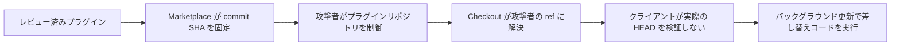

## 昨日からの変化

- **NEW — WaterPlum:** 警察庁と各国の関係機関は、Contagious Interview とも呼ばれる偽採用活動を北朝鮮に公開帰属した。調査対象は100以上の国・地域、3万台を超える感染端末に及ぶ。
- **NEW — Plugin4Shell:** AIR は Claude Code、Codex、GitHub Copilot、Gemini CLI に影響するプラグイン SHA pinning の回避を公開した。Claude Code 2.1.179 と Codex 0.146.0 は修正済み。AIR によれば GitHub Copilot は公開時点で未修正で、Gemini CLI から Antigravity への移行が推奨されている。
- **NEW — Check Point:** CVE-2026-91843 は、影響を受ける Security Management / Log Server で未認証のリモート root コード実行を可能にする。Check Point は実悪用を確認していない。
- **NEW — Microsoft cloud:** Microsoft は Azure AI Foundry の CVE-2026-85889 を公開した。CVSS は 10.0。ホスト型サービスは Microsoft 側で緩和済みで、既知の悪用は報告されていない。
- **NEW — APT36:** Zscaler は Operation RapidRust を公開し、インドとアフガニスタンの政府・防衛組織を狙う RUSTYSHADE、RUSTYMOVE、PSNATCH、BASHNATCH を報告した。

## 優先対応

- **即時:** 影響を受ける Check Point Security Management / Log Server に LivePatch `sk1000155` を適用し、Trusted Clients を明示した管理ホストに限定する。
- **即時:** marketplace プラグインを使う環境では Claude Code を 2.1.179 以降、Codex を 0.146.0 以降へ更新する。未修正クライアントでは SHA pinning だけで実行コードの同一性を保証しない。
- **本日:** 採用経路から届いたコーディングテストやパッケージ導入指示をそのまま実行しない。実行済みの開発端末では WaterPlum 系マルウェア、認証情報窃取、永続化を調査する。
- **本日:** インド、アフガニスタンの政府・防衛環境では RapidRust ツール、異常な private GitHub C2、リムーバブルメディアへのファイル配置、ニュースサイトの typosquat domain を調査する。
- **監視:** Azure AI Foundry の CVE-2026-85889 は Microsoft がサービス側で緩和済みのため、顧客側パッチは不要。インシデント履歴と露出確認のため開示情報を保持する。

## 重点脅威

### WaterPlum の偽採用活動を各国機関が共同で公開帰属

**Severity:** High  
**Status:** 悪性活動を確認済み、公開帰属  
**Threat actor:** WaterPlum / Contagious Interview  
**Malware:** BeaverTail、InvisibleFerret、OtterCookie など  
**Affected:** 採用・コーディングテストを装った誘導を受ける IT 技術者と開発者

9月18日、警察庁と国家サイバー統括室は米国、豪州、ドイツの関係機関と共同文書を公表した。各機関は WaterPlum を北朝鮮と関連付け、偽の採用連絡から開発者に悪性プロジェクトやコーディング課題を実行させる手口を記録している。

調査対象期間は2025年12月から2026年7月。日本当局は、100以上の国・地域で3万台を超える端末が感染し、7,000を超える暗号資産ウォレットに関する情報が侵害され、攻撃者管理ウォレットへ少なくとも17億円相当の暗号資産が移転したと報告している。

#### 対応

- コーディングテストや採用担当者から渡されたリポジトリを未信頼コードとして扱う。依存関係とスクリプトを確認し、本番・クラウド・ウォレットの認証情報を持たない隔離環境で実行する。
- 不審な面接プロジェクトを実行した開発端末では、認証情報窃取、永続化、ウォレットアクセスを調査する。
- 提供コードを実行する前に、別経路で取得した連絡先から採用担当者と企業を確認する。

#### Sources

- [警察庁 — WaterPlum及び北朝鮮IT労働者に関するパブリック・アトリビューション](https://www.npa.go.jp/news/release/2026/20260918001.html)

### Plugin4Shell が主要コーディングエージェントのプラグイン SHA pinning を回避

**Severity:** High  
**Status:** 協調開示、クライアントごとに修正状況が異なる  
**Affected:** Claude Code、OpenAI Codex、GitHub Copilot、Gemini CLI のプラグイン / marketplace フロー

AIR Security は、影響を受けるクライアントが特定 Git commit を要求しても、checkout 後の working tree がその commit に解決されたことを確認しない問題を発見した。Claude Code、Codex、GitHub Copilot では、ホスティングサービスが pinned SHA と同じ形式の branch name を許す場合、プラグインリポジトリを制御する攻撃者が Git の ref 解決を利用できる。Gemini CLI では別の `FETCH_HEAD` 解決経路が報告されている。

バックグラウンドのプラグイン更新により、対象プラグインがすでに導入されていれば後続更新でユーザー操作なしに発火できる。置き換えられたプラグインはコーディングエージェントが持つ権限で実行される。

公開された攻撃チェーンでは、checkout 後に実際のコード同一性を確認しない点が制御上の欠落になる。

#### 対応

- Claude Code を 2.1.179 以降、Codex を 0.146.0 以降へ更新する。
- AIR の公開時点で GitHub Copilot は未修正。最終 commit を検証できないクライアントでは marketplace プラグインを無効化または厳しく制限する。
- AIR によれば Gemini CLI は非推奨で修正予定がない。Google が案内する後継環境へ移行する。
- 内部プラグインツールでは checkout 後に `git rev-parse HEAD` と期待する pinned commit を比較し、不一致なら処理を中止する。

#### Sources

- [AIR Security — Plugin4Shell](https://www.air.security/blog-posts/plugin4shell)

### Check Point 管理サーバー CVE-2026-91843 で未認証 root RCE

**Severity:** Critical  
**Status:** 修正済み、実悪用の確認なし  
**CVSS:** 9.8  
**CVE:** CVE-2026-91843  
**Affected:** `sk1000155` に記載された Check Point Security Management、Multi-Domain Security Management、Log Server

Check Point は、未認証ログイン処理で到達可能な stack-based buffer overflow と説明している。悪用に成功すると root 権限で任意コードを実行できる。管理サービスへ到達できるホストを決める Trusted Clients 設定も露出範囲に影響する。

修正は LivePatch で配布され、自動更新が有効な顧客は保護済みとされる。Check Point は実環境での悪用を示す情報を確認していない。

#### 対応

LivePatch `sk1000155` を適用し、パッチが有効であることを確認する。Trusted Clients は広いネットワーク範囲ではなく、特定の管理システムに限定する。サポート終了版は Check Point が提供する対応経路に従う。

#### Sources

- [Check Point — CVE-2026-91843 Critical Security Update](https://community.checkpoint.com/t5/General-Topics/Important-Notification-Action-required-Critical-Security-Update/m-p/282409)
- [NHS England — CC-4854](https://digital.nhs.uk/cyber-alerts/2026/cc-4854)

## その他の項目

### Azure AI Foundry CVE-2026-85889 はサービス側で緩和済み

**Severity:** Critical  
**Status:** Microsoft が緩和済み、既知の悪用なし  
**CVSS:** 10.0  
**CVE:** CVE-2026-85889  
**Affected:** Azure AI Foundry ホスト型サービス

Microsoft は CVE-2026-85889 を Azure AI Foundry の重要機能における認証欠如として公開した。CVSS vector はネットワーク到達可能、権限とユーザー操作は不要で、機密性・完全性・可用性への影響は High、Scope は Changed とされる。

Microsoft はクラウドサービス側で緩和を完了している。顧客によるパッチや workaround は不要で、公開時点で既知の悪用や公開 exploit code は報告されていない。

#### 対応

顧客側のパッチは不要。通常の保持方針に従ってクラウド監査・ID ログを保持し、緩和前の Foundry への不審アクセスを示す別の兆候がある場合に対象期間を調査する。

#### Sources

- [Microsoft Security Response Center — CVE-2026-85889](https://msrc.microsoft.com/update-guide/vulnerability/CVE-2026-85889)

### APT36 Operation RapidRust が政府・防衛ネットワークを標的化

**Severity:** High  
**Status:** 確認済みサイバー諜報活動  
**Threat actor:** APT36 / Transparent Tribe  
**Malware:** RUSTYSHADE、RUSTYMOVE、PSNATCH、BASHNATCH  
**Affected:** Zscaler が観測したインドとアフガニスタンの政府・防衛組織

Zscaler ThreatLabz は2026年8月にこの活動を観測した。RUSTYSHADE は攻撃者管理の private GitHub repository を C2 に使い、AES-256-GCM で通信を暗号化する Rust 製バックドア。RUSTYMOVE は事前配置した悪性ファイルをリムーバブルメディアへコピーし、隔離ネットワークへ持ち込む経路を作る。PSNATCH と BASHNATCH は Windows と Linux で指定ファイルを収集する。

ThreatLabz は、インドのニュースサイトを模倣する typosquatted domain から PowerShell コンテンツを配置する動きと、侵害後にローカル端末やネットワーク共有を列挙する試みも観測した。

#### 対応

- Zscaler 公開の IOC と malware hash で履歴を検索し、通常 private repository を使わない端末からの異常な GitHub 通信を確認する。
- 機密ワークステーションのリムーバブルメディア操作から、RUSTYMOVE に関連する配置ファイルを調査する。
- インドのニュースサイトを模倣する domain から起動した PowerShell と、異常なネットワーク共有列挙を調査する。

#### Sources

- [Zscaler ThreatLabz — Operation RapidRust](https://www.zscaler.com/blogs/security-research/operation-rapidrust-apt36-deploys-rustyshade-rustymove-psnatch-and)

## 本日の所見

- 直接パッチまたはクライアント更新が必要なのは Check Point 管理サーバーと Plugin4Shell。Azure AI Foundry は Microsoft がサービス側で緩和済み。
- WaterPlum と RapidRust は、正規業務に混ざり得るコード実行経路を使う。前者は面接プロジェクト、後者は GitHub とリムーバブルメディアを利用する。
- 本日報では、脆弱性そのものを「実悪用確認済み」とした項目はない。`exploited` は確認済みの2件の悪性キャンペーンを数え、CVE-2026-91843 と CVE-2026-85889 は含めていない。
