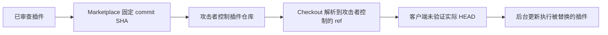

## 相比昨天

- **NEW — WaterPlum：** 日本警察厅与国际合作机构将 Contagious Interview 相关的假招聘攻击公开归因于朝鲜。调查覆盖 100 多个国家和地区、超过 3 万台感染设备。
- **NEW — Plugin4Shell：** AIR 公布插件 SHA pinning 绕过，影响 Claude Code、Codex、GitHub Copilot 和 Gemini CLI。Claude Code 2.1.179 与 Codex 0.146.0 已修复；AIR 报告 GitHub Copilot 尚无修复，并建议 Gemini CLI 用户迁移到 Antigravity。
- **NEW — Check Point：** CVE-2026-91843 可在受影响的 Security Management 和 Log Server 上造成未认证远程 root 代码执行。Check Point 表示尚未观察到在野利用。
- **NEW — Microsoft cloud：** Microsoft 披露 Azure AI Foundry 的 CVE-2026-85889，CVSS 10.0。托管服务已由 Microsoft 缓解，厂商未发现已知利用。
- **NEW — APT36：** Zscaler 公布 Operation RapidRust，记录了针对印度和阿富汗政府、国防目标的 RUSTYSHADE、RUSTYMOVE、PSNATCH 与 BASHNATCH。

## 优先行动

- **立即：** 对受影响的 Check Point Security Management 和 Log Server 应用 LivePatch `sk1000155`，并将 Trusted Clients 限制为明确的管理主机。
- **立即：** 使用 marketplace 插件的环境将 Claude Code 更新到 2.1.179 或更高版本，将 Codex 更新到 0.146.0 或更高版本。未修复客户端不能依赖 SHA pinning 保证实际执行代码的身份。
- **今天：** 开发团队不要直接执行招聘渠道发送的编码测试项目或安装命令；如果已经执行，检查开发机是否存在 WaterPlum 相关恶意软件、凭据窃取或持久化行为。
- **今天：** 印度、阿富汗的政府和国防环境检查 RapidRust 工具、异常私有 GitHub C2、可移动介质文件投放以及仿冒新闻网站域名。
- **监控：** Azure AI Foundry 的 CVE-2026-85889 已由 Microsoft 在服务端缓解，无需客户安装补丁；保留该披露用于事件历史和暴露面核查。

## 重点关注

### WaterPlum 假招聘活动获得多国联合公开归因

**Severity:** High  
**Status:** 已确认恶意活动；公开归因  
**Threat actor:** WaterPlum / Contagious Interview  
**Malware:** BeaverTail、InvisibleFerret、OtterCookie 及相关工具  
**Affected:** 通过招聘和编码测试诱饵接触的 IT 从业者与开发者

9 月 18 日，日本警察厅和国家网络统括室与美国、澳大利亚、德国相关机构发布联合归因。公告将 WaterPlum 与朝鲜关联，并记录了攻击者通过假招聘接触开发者、要求运行恶意项目或编码作业的手法。

调查覆盖 2025 年 12 月至 2026 年 7 月。日本官方报告称，100 多个国家和地区有超过 3 万台设备感染，攻击涉及 7,000 多个加密货币钱包的信息，攻击者控制的钱包至少收到 17 亿日元的加密资产。

#### 建议

- 将编码测试和招聘方提供的代码仓库视为不可信代码。执行前检查依赖清单和脚本，并在没有生产环境、云服务或钱包凭据的隔离环境中运行。
- 对已经执行过陌生面试项目的开发终端检查凭据窃取、持久化和钱包访问行为。
- 运行对方提供的代码前，通过独立获取的联系方式验证招聘人员和企业身份。

#### Sources

- [日本警察厅 — 关于 WaterPlum 与朝鲜 IT 劳动者的公开归因](https://www.npa.go.jp/news/release/2026/20260918001.html)

### Plugin4Shell 绕过主要编码代理的插件 SHA pinning

**Severity:** High  
**Status:** 协调披露；各客户端修复状态不同  
**Affected:** Claude Code、OpenAI Codex、GitHub Copilot、Gemini CLI 的插件与 marketplace 流程

AIR Security 发现，受影响客户端会请求固定到某个 Git commit 的插件，但不会验证 checkout 后的 working tree 是否真的解析到该 commit。对于 Claude Code、Codex 和 GitHub Copilot，如果代码托管服务允许创建名称形似目标 SHA 的分支，控制插件仓库的攻击者可以利用 Git ref 解析行为。AIR 还记录了 Gemini CLI 中独立的 `FETCH_HEAD` 解析路径。

插件后台更新使已经安装的插件可以在后续更新时无交互触发该问题。被替换的插件继承编码代理进程已有的权限。

公开攻击链中的控制缺口是 checkout 后没有验证实际代码身份。

#### 建议

- 将 Claude Code 更新到 2.1.179 或更高版本，将 Codex 更新到 0.146.0 或更高版本。
- AIR 披露时 GitHub Copilot 尚无修复。无法验证最终 commit 的客户端应禁用或严格限制 marketplace 插件。
- AIR 表示 Gemini CLI 已弃用且不会修复；按 Google 建议迁移相关工作流。
- 内部插件工具在 checkout 后比较 `git rev-parse HEAD` 与预期 pinned commit，不一致时直接终止。

#### Sources

- [AIR Security — Plugin4Shell](https://www.air.security/blog-posts/plugin4shell)

### Check Point 管理服务器 CVE-2026-91843 可造成未认证 root RCE

**Severity:** Critical  
**Status:** 已修复；无已确认在野利用  
**CVSS:** 9.8  
**CVE:** CVE-2026-91843  
**Affected:** `sk1000155` 列出的 Check Point Security Management、Multi-Domain Security Management 与 Log Server 版本

Check Point 将问题描述为未认证登录流程中的 stack-based buffer overflow。成功利用可用 root 权限执行任意代码。实际暴露面还受到 Trusted Clients 配置影响，该配置决定哪些主机可以访问管理服务。

Check Point 通过 LivePatch 分发修复，并表示启用自动更新的客户已经受到保护。厂商目前没有发现该漏洞被在野利用的迹象。

#### 建议

应用 LivePatch `sk1000155` 并确认补丁处于生效状态。Trusted Clients 应限制为明确的管理系统，不要使用过宽的网络范围。已停止支持的版本按 Check Point 提供的支持路径处理。

#### Sources

- [Check Point — CVE-2026-91843 Critical Security Update](https://community.checkpoint.com/t5/General-Topics/Important-Notification-Action-required-Critical-Security-Update/m-p/282409)
- [NHS England — CC-4854](https://digital.nhs.uk/cyber-alerts/2026/cc-4854)

## 其他值得关注

### Azure AI Foundry CVE-2026-85889 已在服务端缓解

**Severity:** Critical  
**Status:** Microsoft 已缓解；无已知利用  
**CVSS:** 10.0  
**CVE:** CVE-2026-85889  
**Affected:** Azure AI Foundry 托管服务

Microsoft 将 CVE-2026-85889 归因于 Azure AI Foundry 关键功能缺少身份验证。CVSS 向量显示该问题可通过网络触达，不要求已有权限或用户交互，并对机密性、完整性和可用性产生高影响，Scope 为 Changed。

Microsoft 表示云服务已经完成缓解，客户无需部署补丁或 workaround；披露时没有已知在野利用或公开 exploit code。

#### 建议

无需客户侧补丁。按现有保留策略保存相关云审计和身份日志；如果有其他证据表明缓解前存在异常 Foundry 访问，再针对该时间段调查。

#### Sources

- [Microsoft Security Response Center — CVE-2026-85889](https://msrc.microsoft.com/update-guide/vulnerability/CVE-2026-85889)

### APT36 Operation RapidRust 针对政府和国防网络

**Severity:** High  
**Status:** 已确认网络间谍活动  
**Threat actor:** APT36 / Transparent Tribe  
**Malware:** RUSTYSHADE、RUSTYMOVE、PSNATCH、BASHNATCH  
**Affected:** Zscaler 观察到的印度和阿富汗政府、国防机构

Zscaler ThreatLabz 在 2026 年 8 月观察到该活动。RUSTYSHADE 是 Rust 后门，使用攻击者控制的私有 GitHub 仓库作为 C2，并用 AES-256-GCM 加密通信。RUSTYMOVE 将预先准备的恶意文件复制到可移动介质，为进入隔离网络提供路径。PSNATCH 和 BASHNATCH 分别在 Windows 与 Linux 上收集指定文件。

ThreatLabz 还观察到仿冒印度新闻网站的 typosquatted domains 被用于投放 PowerShell 内容，以及入侵后识别局域网主机和网络共享的行为。

#### 建议

- 使用 Zscaler 公布的 IOC 和恶意软件 hash 搜索历史活动，并检查通常不访问私有仓库的系统是否出现异常 GitHub 流量。
- 在敏感工作站上检查可移动介质活动，寻找与 RUSTYMOVE 相关的预置文件。
- 监控从仿冒印度新闻网站域名触发的 PowerShell，并调查异常网络共享枚举。

#### Sources

- [Zscaler ThreatLabz — Operation RapidRust](https://www.zscaler.com/blogs/security-research/operation-rapidrust-apt36-deploys-rustyshade-rustymove-psnatch-and)

## 今日观察

- 需要直接执行补丁或客户端升级的有两项：Check Point 管理服务器和 Plugin4Shell。Azure AI Foundry 已由 Microsoft 在服务端完成缓解。
- WaterPlum 与 RapidRust 都利用了可能混入正常工作流程的代码执行路径：前者使用面试项目，后者涉及 GitHub 与可移动介质。
- 本期没有把任何漏洞标记为「已确认在野利用」。`exploited` 统计对应两项已确认恶意活动，不包括 CVE-2026-91843 和 CVE-2026-85889。
